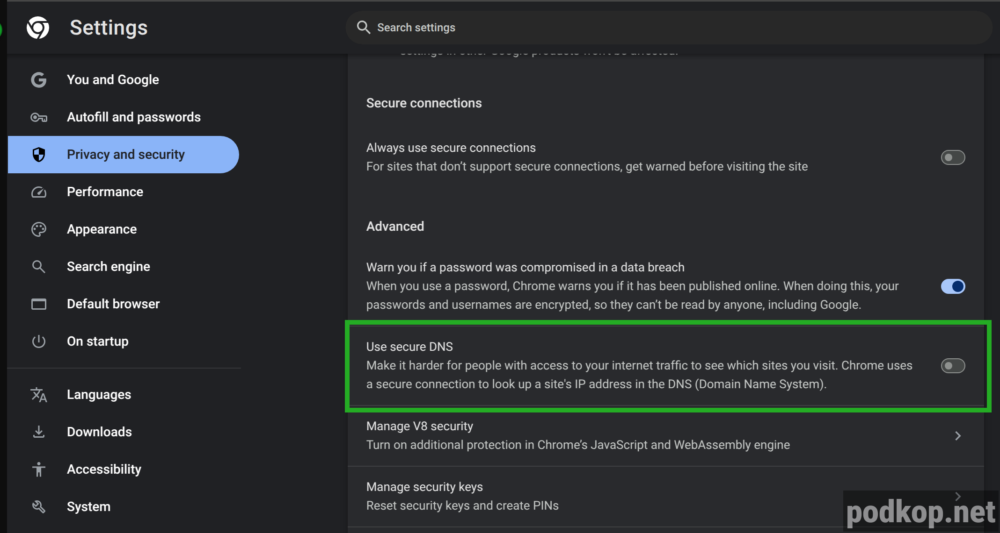

Чтобы podkop работал корректно, необходимо, чтобы клиенты использовали роутер в качестве DNS-сервера. 

Если у вас запрос
```nslookup fakeip.podkop.fyi```
Не резолвится в IP-адрес из подсети **198.18.0.0/15**, то проблема либо в неправильно настроенном сетевом интерфейсе, либо в DoH, включённом в браузере. Если речь идёт про Android, то проблема может быть в том, что вся система использует DoH.

DoH нет на уровне систем iOS, MacOS и Linux. В Windows 11 DoH появилась на уровне системы, но по умолчанию выключена. 

В Safari DoH отсутствует. Обратите внимание, что в ОС, перечисленных выше, DoH может быть включён на уровне браузера.

Далее приведены инструкции как это отключить в разных случаях.

# Браузеры
Все популярные браузеры используют DoH по умолчанию, это означает, что все DNS-запросы идут мимо роутера.

## Chrome
**Настройки | Settings** - **Приватность и безопасность | Privacy and security**

Промотайте вниз до **Использовать безопасный DNS | Use secure DNS** и выключите его.


## FireFox
**Настройки | Settings** - **Приватность и безопасность | Privacy & security**

Промотайте вниз до **DNS over HTTPS** и выберите **Off**.


## Android
Во всех последних версиях Android DoH включён на уровне системы, там он именуется **Приватный DNS | Private DNS**.

Проще всего найти его по поиску, введя **Private DNS**.

Либо **Настройки | Settings** - **Подключения и обмен** - **Приватный DNS | Private DNS**


## Windows
В Windows 11 DoH на уровне системы можно включить только специально в режиме ручной настройки DNS. Если вы это не трогали, то скорее всего, он у вас выключен. Это легко проверить.

Для кабеля и Wi-Fi он включается и отключается в свойствах подключения.

### Ethernet (кабель)
**Сеть и Интернет | Network & internet** - **Ethernet**

Опция **Назначение DNS-сервера | DNS server assignment** должна стоять в режиме **Автоматически | Automatic (DHCP)**


### Wi-Fi
**Сеть и Интернет | Network & internet** - **Wi-Fi**

Выбираете свойства вашего подключения

Опция **Назначение DNS-сервера | DNS server assignment** должна стоять в режиме **Автоматически | Automatic (DHCP)**


### Отключение IPv6

Если при выполнении команды `nslookup` вы видите в ответе адреса вида `2001:0db8:11a3:09d7:1f34:8a2e:07a0:765d` значит на адаптере не отключена поддержка ipv6. 

Чтобы при работе с Podkop не было проблем, потребуется отключить его поддержку. Для этого переходим в **Параметры сети Интернет | Настройка параметров адаптера | Свойства** и снимаем галочку с **IP версии 6(TCP/IPv6)**


---

Проверьте, что в информации о подключении в пункте **IPv4 DNS servers** указан ваш роутер.


## Другие ОС
Необходимо, чтобы на интерфейсе устройства был настроен роутер в качестве DNS-сервера.

Во-первых проверьте, что интерфейс получает настройки от роутера по DHCP.


Если вы используете статику и она вам необходима, то в DNS обязательно должен быть указан роутер в качестве DNS.

Во-вторых проверьте, что интерфейс получил в качестве DNS-сервера IP-адрес роутера.


### SberTV

Пользователь из чата обнаружил, что телевизор СберТВ обращается к 8.8.8.8 по 853 порту, что мешало нормальной работе `Podkop`. Решением проблемы стала блокировка обращения к DoH и порту 853 из локальной сети. Если у вас похожая проблема воспользуйтесь [документацией](https://openwrt.org/docs/guide-user/firewall/fw3_configurations/intercept_dns).

### Chromecast

Пользователь столкнулся с тем, что устройство использует встроенные DNS-сервера от Google из-за чего трафик не попадает в Podkop. Проблему удалось решить через редирект DNS на уровне firewall.

В файл /etc/config/firewall добавить следующее:

```shell
config redirect
    option name 'Intercept DNS LAN'
    option src 'lan'
    option proto 'tcp udp'
    option src_dport '53'
    option dest_port '53'
    option target 'DNAT'
```
и выполнить `service firewall restart`.

После этого запросы проходят через dnsmasq роутера.
