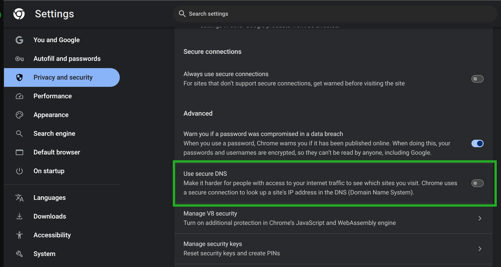
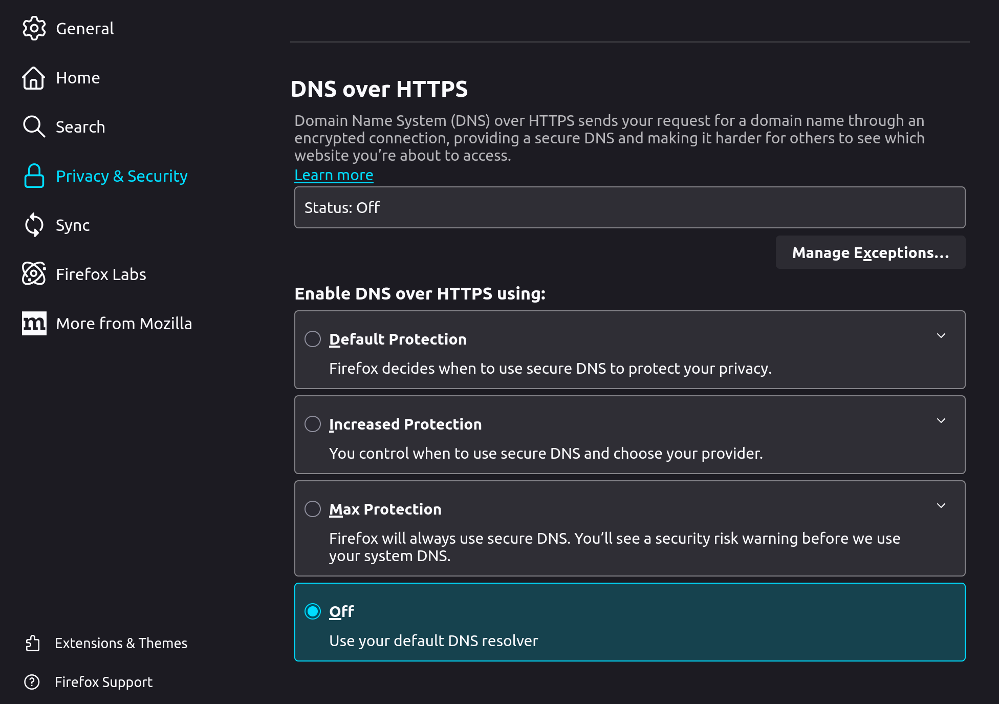
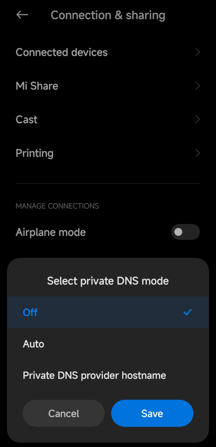
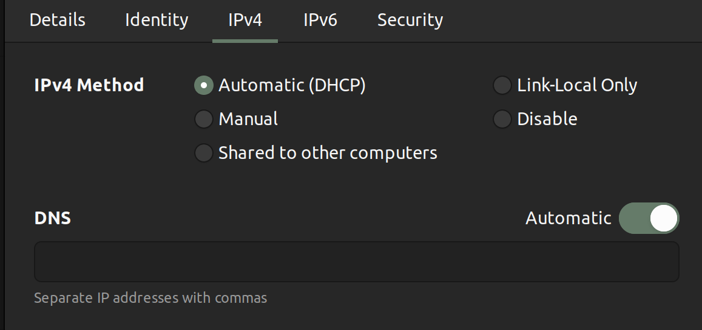
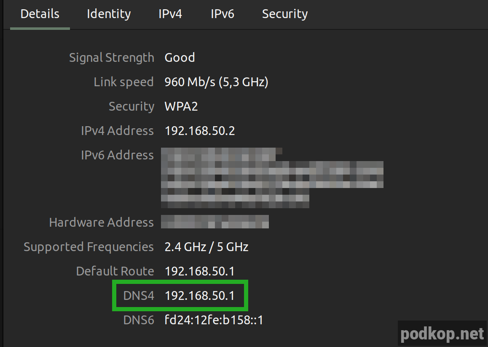

Чтобы podkop работал корректно, необходимо, чтобы клиенты использовали роутер в качестве DNS-сервера. 

Если у вас запрос
```nslookup fakeip.tech-domain.club```
Не резолвится в IP-адрес из подсети **198.18.0.0/15**, то проблема либо в неправильно настроенном сетевом интерфейсе, либо в DoH, включённом в браузере. Если речь идёт про Android, то проблема может быть в том, что вся система использует DoH.

DoH нет на уровне систем iOS, MacOS и Linux. В Windows 11 DoH появилась на уровне системы, но по умолчанию выключена. 

В Safari DoH отсутствуетd. Обратите внимание, что в ОС, перечисленных выше, DoH может быть включён на уровне браузера.

Далее приведены инструкции как это отключить в разных случаях.

# Браузеры
Все популярные браузеры используют DoH по умолчанию, это означает, что все DNS-запросы идут мимо роутера.

## Chrome
**Настройки | Settings** - **Приватность и безопасность | Privacy and security**

Промотайте вниз до **Использовать безопасный DNS | Use secure DNS** и выключите его.


## FireFox
**Настройки | Settings** - **Приватность и безопасность | Privacy & security**

Промотайте вниз до **DNS over HTTPS** и выберите **Off**.


# Android
Во всех последних версиях Android DoH включён на уровне системы, там он именуется **Приватный DNS | Private DNS**.

Проще всего найти его по поиску, введя **Private DNS**.

Либо **Настройки | Settings** - **Подключения и обмен** - **Приватный DNS | Private DNS**



# Windows
DoH и интерфейсы

# Другие ОС
Необходимо, чтобы на интерфейсе устройства был настроен роутер в качестве DNS-сервера.

Во-первых проверьте, что интерфейс получает настройки от роутера по DHCP.


Если вы используете статику и она вам необходима, то в DNS обязательно должен быть указан роутер в качестве DNS.

Во-вторых проверьте, что интерфейс получил в качестве DNS-сервера IP-адрес роутера.


