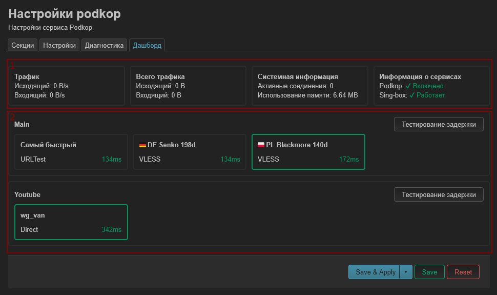

Отображает статистику работы `sing-box`, секции и указанные в них туннели и позволяет переключать прокси при использовании **URLTest**.

Условно можно разделить на два раздела:

## 1. Статистика

Отображает общую статистику для всех указанных в секциях активных туннелей.

#### Трафик

Отображает текущую входящую и исходящую скорость для проходящего через туннели трафика.

#### Всего трафика

Статистика входящего и исходящего трафика, прошедшего через туннели с момента последнего перезапуска `sing-box`.

#### Системная информация

Число текущих активных соединений `sing-box` и использование памяти.

#### Информация о сервисах

Статус работы `sing-box` и `podkop`.

## 2. Секции

Содержит заголовок секции и список используемых в секции туннелей.

Если в секции в качестве типа конфигурации для **Proxy** выбран `URLTest`, то по умолчанию будет использоваться **Самый быстрый**. В этом случае `sing-box` автоматически переключит сервер, если текущий сервер станет недоступен.

Вы можете выбрать конкретный сервер для использования, кликнув мышкой по имени желаемого сервера. В таком случае `sing-box` не выполнит автоматического переключения, в случае если сервер станет недоступен.

>[!Note]
>Если в опции **Cache File Path** вкладки **Settings** используется `RAM`, то после перезагрузки устройства вернется режим автоматического переключения ссылок.

Кнопка **Тестирование задержки** позволяет немедленно запустить проверку задержки для отображаемых серверов.

