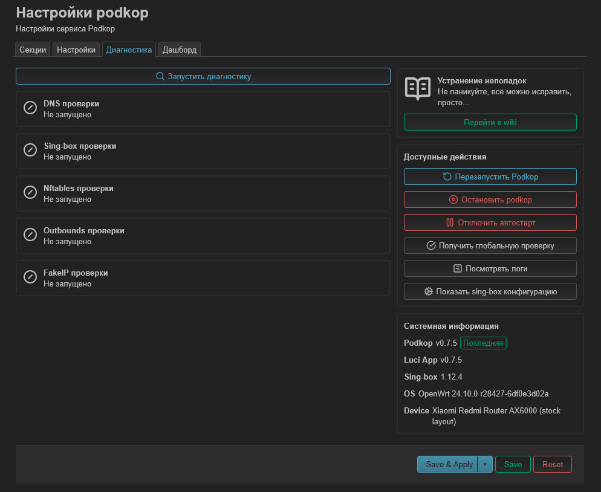
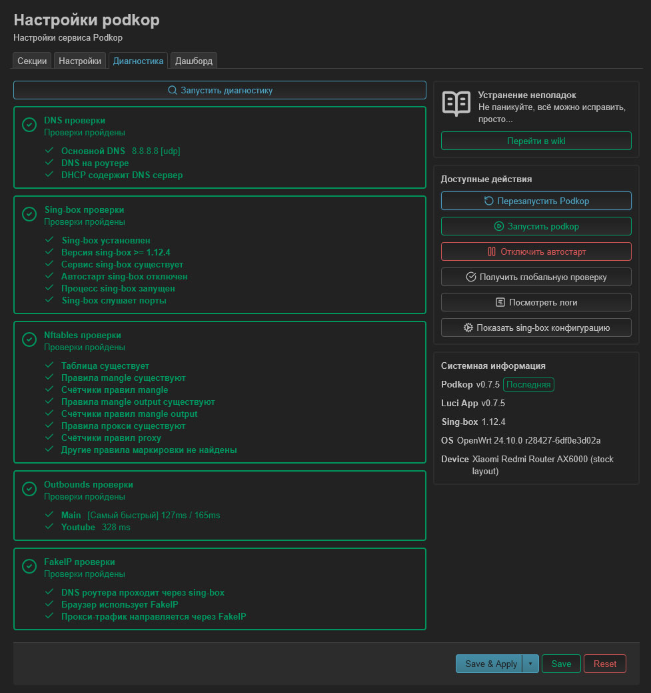

Если у вас какая-то из проверок не прошла, но при этом все работает, то пропуститe этот раздел. 

Если ничего или какая-то часть не работает, то вы по адресу.

## Самостоятельное решение проблем

В первую очередь после настройки перейдите во вкладку **Диагностика | Diagnostics**.



Начиная с версии **0.7** диагностика не запускается автоматически, при переходе на вкладку.

Чтобы выполнить диагностику необходимо нажать кнопку **Запустить диагностику**.

В случае, если все проверки прошли успешно вы увидите следующее:



 Здесь на скриншоте всё зелёное, а значит скорее всего, всё ок. 

Помните, при обновлении всегда нужно [чистить кэш](/docs/clear-browser-cache/).

Диагностика включает в себя следующие разделы:

## Проверки

Рамка зеленого цвета означает, что все проверки пройдены, желтого цвета - предупреждение, а красного - ошибку.

Проверяйте статусы в таблице последовательно. Если вы видите ошибку, решайте проблему на этом шаге, прежде чем двигаться дальше.

###  DNS проверки
---

Если один из пунктов содержит ошибку то мы получим предупреждение. Если все проверки не прошли мы получим ошибку.

| Имя                          | Статус | Описание                                                                                                            |
|:-----------------------------|:------:|:--------------------------------------------------------------------------------------------------------------------|
| **Основной DNS**             | -      | Отображает тип и DNS.                                                                                               |
|                              | ✓      | Выбранный DNS работает.                                                                                             |
|                              | ✗      | Выбранный DNS не работает. Пробуйте другой                                                                          |
| **Bootstrap DNS**            | -      | По умолчанию не видна. Только при проблемах с DNS.                                                                  |
|                              | ✓      | Выбранный DNS работает.                                                                                             |
|                              | ✗      | Выбранный DNS не работает, пробуйте другой.                                                                         |
| **DNS на роутере**           | -      | Проверяет работу DNS на роутере.                                                                                    |
|                              | ✓      | DNS на роутере работает.                                                                                            |
|                              | ✗      | DNS на роутере сломан. [«Проверка настроек DNS на роутере»](/docs/troubleshooting#проверка-настроек-dns-на-роутере) |
| **DHCP содержит DNS сервер** | -      | В `dnsmasq` указан адрес 127.0.0.42                                                                                 |
|                              | ✓      | DNS-запросы направляются в `sing-box`                                                                               |
|                              | ✗      | Необходимо [проверить](/docs/troubleshooting#проверка-настроек-dns-на-роутере) конфигурацию `dnsmasq` на роутере.   |

### Sing-box проверки
---

Если один из пунктов содержит ошибку то мы получим предупреждение. Если `sing-box` не запущен или все проверки не прошли, мы получим ошибку.

| Имя                             | Статус | Описание                                                                                                                         |
|:--------------------------------|:------:|:---------------------------------------------------------------------------------------------------------------------------------|
| **Sing-box установлен**         | -      | Проверка установлен ли `sing-box`.                                                                                               |
|                                 | ✓      | Установлен. работает.                                                                                                            |
|                                 | ✗      | Не установлен.                                                                                                                   |
| **Версия sing-box >= 1.12.4**   | -      | Версия `sing-box` не ниже 1.12.4                                                                                                 |
|                                 | ✓      | Соответствует необходимой версии.                                                                                                |
|                                 | ✗      | Версия не соответствует необходимой. Выполните установку версии 1.12.4 и выше.                                                   |
| **Сервис sing-box существует**  | -      | Проверяет наличие файла **sing-box** в `/etc/init.d`.                                                                            |
|                                 | ✓      | Файл найден.                                                                                                                     |
|                                 | ✗      | Файл не найден. Выполните переустановку `sing-box`.                                                                              |
| **Автостарт sing-box отключен** | -      | Отключен ли автозапуск `sing-box`.                                                                                               |
|                                 | ✓      | `podkop` управляет работой `sing-box`.                                                                                           |
|                                 | ✗      | Автостарт `sing-box` активен. Перейдите в **System -> Startup** и нажмите кнопку **Enabled** рядом с `sing-box`.                 |
| **Процесс sing-box запущен**    | -      | Статус работы `sing-box`.                                                                                                        |
|                                 | ✓      | `sing-box` запущен.                                                                                                              |
|                                 | ✗      | Ошибка при настройке `podkop`, `sing-box` не смог стартовать.                                                                    |
| **Sing-box слушает порты**      | -      | Проверяет необходимые для работы `sing-box` порты.                                                                               |
|                                 | ✓      | Необходимые порты свободны и прослушиваются.                                                                                     |
|                                 | ✗      | Порт занят другим сервисом. [Проверьте](/docs/troubleshooting#проверка-настроек-dns-на-роутере) какие службы прослушивают порты. |

### Nftables проверки
---

Если один из пунктов содержит ошибку или предупреждение то мы получим предупреждение. Если в пункте **Другие правила маркировки** ошибка, мы получим предупреждение. Если ни одна проверка не прошла, мы получим ошибку.

| Имя                                      | Статус | Описание                                                                                                                              |
|:-----------------------------------------|:------:|:--------------------------------------------------------------------------------------------------------------------------------------|
| **Таблица существует**                   | -      | Проверяет наличие таблицы **PodkopTable**.                                                                                            |
|                                          | ✓      | Таблица найдена.                                                                                                                      |
|                                          | ✗      | Таблица отсутствует.                                                                                                                  |
| **Правила mangle существуют**            | -      | Проверяет наличие правил цепочки **mangle** в таблице **PodkopTable**.                                                                |
|                                          | ✓      | Правила найдены.                                                                                                                      |
|                                          | ✗      | Правила не найдены. [Проверьте](/docs/troubleshooting#проверка-правил-маркировки-и-проксирования-трафика) правила маркировки трафика. |
| **Счётчики правил mangle**               | -      | Проверяет что трафик проходит через правила цепочки **mangle**.                                                                       |
|                                          | ✓      | Трафик от клиентских устройств доходит до роутера.                                                                                    |
|                                          | ✗      | Счетчики нулевые, трафик от клиентских устройств не доходит до роутера. Проблема с DNS или шлюзом на клиенте.                         |
| **Правила mangle output существуют**     | -      | Проверяет наличие правил цепочки **mangle_output** в таблице. **PodkopTable**.                                                        |
|                                          | ✓      | Правила найдены.                                                                                                                      |
|                                          | ✗      | Правила не найдены. [Проверьте](/docs/troubleshooting#проверка-правил-маркировки-и-проксирования-трафика) правила маркировки трафика. |
| **Счётчики правил mangle output**        | -      | Проверяет что трафик проходит через правила цепочки **mangle_output**.                                                                |
|                                          | ✓      | Трафик проходит через правила цепочки **magle_output**.                                                                               |
|                                          | ✗      | Трафик не проходит через правила.                                                                                                     |
| **Правила прокси существуют**            | -      | Проверяет наличие правил цепочки **proxy** в таблице.                                                                                 |
|                                          | ✓      | Правила найдены.                                                                                                                      |
|                                          | ✗      | Правила не найдены. [Проверьте](/docs/troubleshooting#проверка-правил-маркировки-и-проксирования-трафика) правила маркировки трафика  |
| **Счётчики правил proxy**                | -      | Проверяет что трафик проходит через правила цепочки **proxy**                                                                         |
|                                          | ✓      | Трафик проходит через правила цепочки **magle_output**.                                                                               |
|                                          | ✗      | Трафик не проходит через правила.                                                                                                     |
| **Другие правила маркировки не найдены** | -      | Проверяет наличие правил `nftables`, мешающие работе `podkop`.                                                                        |
|                                          | ✓      | Конфликтующие правила отсутствуют.                                                                                                    |
|                                          | ⚠      | Присутствуют конфликтующие правила,(например, неудалённый **GetDomains**, `vpn-client` на прошивках GL.iNet.                          |


### Outbounds проверки
---

Если один из прокси не прошел проверку то мы получим предупреждение. Если ни один прокси не ответил, мы получим ошибку.

Ниже, в таблице, приведен пример в случае, когда вы используете **URLTest** и когда отдельный сервер, выбранный с помощью селектора в **Дашборде** или **Yacd**. В случае, если вы используете режим **VPN** вы увидите имя секции и задержку, используемого в секции туннеля.

| Имя                                              | Статус | Описание                                                                                                                                |
|:-------------------------------------------------|:------:|:----------------------------------------------------------------------------------------------------------------------------------------|
| **Outbounds check**                              | -      | Проверяет что прокси работает и указывает его задержку.                                                                                 |
| **Main [Fastest] 124ms / 172ms / 174ms / 152ms** | -      | Имя секции, имя режима работы. Отображает задежку всех прокси, указанных для **URLTest** от которых был получен ответ. |
|                                                  | ✓      | Проверка пройдена успешно.                                                                                                              |
|                                                  | ✗      | Прокси не доступен или не ответил в течении 10с.                                                                                        |
| **Main [Ihor] 364ms**                            | -      | Имя секции, имя выбранного прокси и его задержка.                                                                                                |
|                                                  | ✓      | Проверка пройдена.                                                                                                                      |
|                                                  | ✗      | Прокси не доступен или не ответил в течении 5с.                                                                                         |

### FakeIP проверки
---

Если ни одна проверка не прошла, мы получим ошибку.

| Имя                                         | Статус | Описание                                                                                                                                                                                                           |
|:--------------------------------------------|:------:|:-------------------------------------------------------------------------------------------------------------------------------------------------------------------------------------------------------------------|
| **DNS роутера проходит через sing-box**     | -      | Проверяет что `sing-box` на роутере корректно отвечает FakeIP-адресом.                                                                                                                                             |
|                                             | ✓      | `sing-box` корректно отвечает FakeIP-адресом.                                                                                                                                                                      |
|                                             | ⚠      | Ответ на DNS-запрос не получен. вероятно, `sing-box` не работает, либо запросы перехватывает другая DNS-служба.                                                                                                     |
| **Браузер использует FakeIP**               | -      | Проверяет работу FakeIP с браузера.                                                                                                                                                                                |
|                                             | ✓      | Проверка пройдена, HTTPS-запрос к диагностическому домену прошел через sing-box.                                                                                                                                   |
|                                             | ✗      | Браузер не использует DNS-роутера или проблемы с диагностическим доменом. [Проверьте](/docs/client-dns) DNS на устройствах.                                                                                        |
| **Прокси-трафик направляется через FakeIP** | -      | Проверяем корректность работы туннеля c FakeIP.                                                                                                                                                                    |
|                                             | ✓      | Туннель работает. Запросы к диагностическим доменам вернули разные адреса.                                                                                                                                         |
|                                             | ✗      | Возможна в следующих случаях: 1. Проверка **Браузер использует FakeIP** не пройдена. 2. Клиентское устройство добавлено в **Полностью маршрутизируемые IP-адреса**, в настройках секции. 3. Прокси не работает. 4. VPN на устройстве заворачивает все запросы в туннель. |

## Доступные действия

| Имя действия                       | Описание                                                                                                                    |
|:-----------------------------------|:----------------------------------------------------------------------------------------------------------------------------|
| **Перезапустить Podkop**           | Перезапускает службу `podkop`                                                                                               |
| **Остановить Podkop**              | Останавливает `podkop`. В случае если автостарт не отключен, при перезагрузке `podkop` запустится.                          |
| **Отключить автостарт**            | Отключает автостарт `podkop` при перезагрузке устройства.                                                                   |
| **Получить глобальную проверку**   | **Global check**. Пригодится вам, если вы не сможете самостоятельно решить проблему и захотите обратиться в чат за помощью. |
| **Посмотреть логи**                | Отображает логи работы `podkop` и `sing-box`.                                                                               |
| **Показать sing-box конфигурацию** | Отображает текущую конфигурацию `sing-box`.                                                                                 |

## Системная информация

| Имя            | Описание                                 |
|:---------------|:-----------------------------------------|
| **Podkop**     | Установленная версия `podkop`            |
| **Luci App**   | Установленная версия `luci-app-podkop`   |
| **Sing-box**   | Установленная версия `sing-box`          |
| **OS OpenWRT** | Версия используемой на роутере `OpenWRT` |
| **Device**     | Модель вашего устройства                 |

## Не работает на одном из устройств

Если у вас не работает на опредленном устройстве, скорее всего, дело в DoH. Внимательно изучите эту [инструкцию](/docs/client-dns/)

Последний пункт, который может вам помочь - это **Global Check**. Если вы не понимаете вывод, переходите к следующему абзацу.

Если у вас не работает диагностика в LuCi или вы не используете LuCi, Global Check можно вызвать через командную строку:
```
/usr/bin/podkop global_check
```

## Данный раздел не помог решить проблему
Если вам не удалось решить проблему самостоятельно, воспользуйтесь кнопкой **Перейти в wiki** справа, которая ведет на страницу [Поиск и устранение неисправностей](/docs/troubleshooting), на которой описаны наиболее часто возникающие проблемы.

## Помощь зала

**Официальный чат** Podkop`a https://t.me/itdogchat/81758. Рекомендуем именно в нём спрашивать всё про Podkop. В нём сидят разработчики и просто умные люди, понимающие в OpenWrt и схеме FakeIP. В других чатах вы можете столкнуться с дичью и дилетанством.

Если вы не осилили самостоятельно решить проблему и выполнили все пункты:
- Проверили DNS на устройствах
- Попробовали с заведомо рабочими VLESS из **Community sub**
- На ваших клиентах запрос ```nslookup fakeip.podkop.fyi``` отдаёт IP-адрес из подсети **198.18.0.0/15**

Скидывайте вывод **Global check** в чат ТЕКСТОМ. Он сразу отформатирован под код, не убирайте кавычки. Также допишите, что вы пробовали, что именно не работает и все ли пункты выше у вас выполнены.
