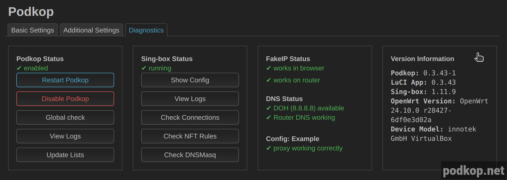

Если у вас ничего или какая-то часть не работает, то вы по адресу.

# Самостоятельное решение проблем

В первую очередь после настройки перейдите во вкладку **Диагностика | Diagnostics**.



Здесь на скриншоте всё зелёное, а значит скорее всего, всё ок. Разберём, что делать, если у вас какой-то пункт красный.

Помните, при обновлении всегда нужно [чистить кэш](/docs/clear-browser-cache/).

## Podkop Status
Статус говорит о том, что служба включена на автозапуск.

## Sing-box Status
Если статус "not running", это означает, что вы неправильно настроили podkop и sing-box не смог стартовать. 

## FakeIP Status
- **works in browser** красный цвет говорит о том, что DNS-запросы из вашего браузера не доходят до Sing-box. Проверьте, что комьютер использует [роутер в качестве DNS-сервера и что в браузере отключен DoH](/docs/client-dns/).

- **works on router** тут красный цвет говорит о том, что FakeIP не настроен на роутере, и проблема в вашей конфигурации. Проверяйте прокси и попробуйте убрать пользовательские списки.

## DNS Status
- Первая строка отображает тип DNS и адрес. Если имеет красный цвет, то выбранный DNS у вас не работает. Пробуйте другой.
- Вторая строка говорит о работе DNS на самом роутере. Если имеет красный цвет, вы поломали DNS на роутере.

## Config
- Эта проверка сравнивает ваш провайдерский IP-адрес и IP-адрес прокси. Если тут красный цвет, значит Proxy/VPN не работают. Пробуйте другую конфигурацию, для тестов можете взять из **Community Sub**.

Если у вас не работает на опредленном устройстве, скорее всего, дело в DoH. Внимательно изучите эту [инструкцию](/docs/client-dns/)

Последний пункт, который может вам помочь - это **Global Check**. Если вы не понимаете вывод, переходите к следующему абзацу.

Если у вас не работает диагностика в LuCi или вы не используете LuCi, Global Check можно вызвать через командную строку:
```
/usr/bin/podkop global_check
```

# Помощь зала

**Официальный чат** Podkop`a https://t.me/itdogchat/81758. Рекомендуем именно в нём спрашивать всё про Podkop. В нём сидят разработчики и просто умные люди, понимающие в OpenWrt и схеме FakeIP. В других чатах вы можете столкнуться с дичью и дилетанством.

Если вы не осилили самостоятельно решить проблему и выполнили все пункты:
- Проверили DNS на устройствах
- Попробовали с заведомо рабочими VLESS из **Community sub**
- На ваших клиентах запрос ```nslookup fakeip.podkop.fyi``` отдаёт IP-адрес из подсети **198.18.0.0/15**

Скидывайте вывод **Global check** в чат ТЕКСТОМ. Он сразу отформатирован под код, не убирайте кавычки. Также допишите, что вы пробовали, что именно не работает и все ли пункты выше у вас выполнены.