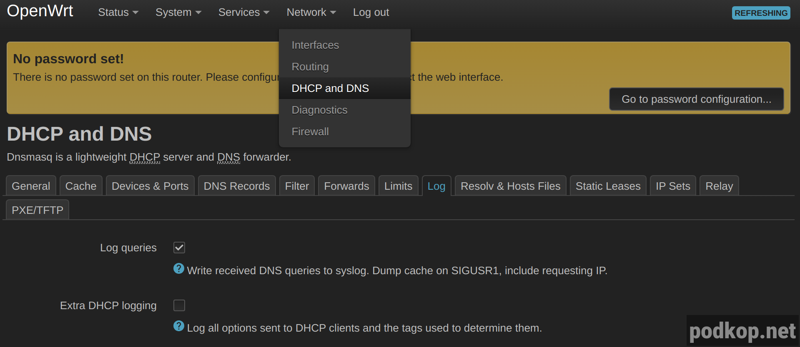

Если вам нужно понять какие домены запрашивает ваше устройство у роутера или проверить точно ли оно обращается к роутеру с DNS-запросами, вы можете отследить это в логах Dnsmasq.

В LuCi переходите **Network** - **DHCP and DNS** выбираете вкладку **Log**.



Активируете **Log queries** и **Save & Apply**. Теперь в syslog у вас будут записываться все DNS-запросы, которые приходят к роутеру.

Два способа посмотреть логи:

1. LuCi: **Status** - **System log**, кнопка **Scroll to tail**. Вы окажитесь в самом конце лога и теперь будет видны все DNS-запросы, которые приходят к роутеру.


2. Консоль: ```logread -f -e dnsmasq```

Проверить, что DNS-запрос отображется в логах можно командами

```nslookup itdog.info 192.168.1.1```
или
```dig itdog.info @192.168.1.1```

