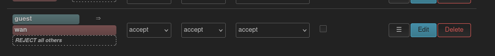
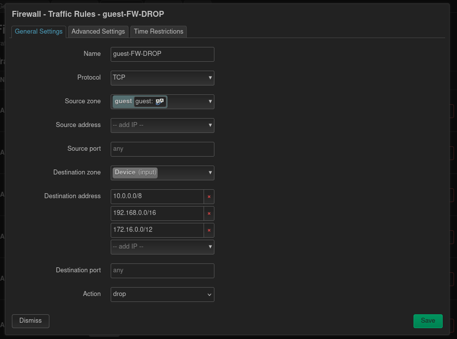

## Установка и обновление

#### Как установить Podkop?
Используйте команду автоматической установки
```shell
sh <(wget -O - https://raw.githubusercontent.com/itdoginfo/podkop/refs/heads/main/install.sh)
```
Подробности в [Установка](/docs/install)

#### Как правильно обновить `sing-box`?
**Вариант 1: Обновление через скрипт `Podkop`**  
[Скрипт для автоматической установки](/docs/install/#avtomaticheskaya-ustanovka-i-obnovlenie)
обновит `sing-box`, если ваша текущая версия ниже минимально необходимой для работы `Podkop`.

**Вариант 2: Обновление до последней версии вручную**  
Если вы хотите установить самую свежую версию `sing-box` из репозитория OpenWrt, используйте следующие команды:
```shell
# Останавливаем сервис, чтобы безопасно обновить его зависимость
service podkop stop

# Обновляем список доступных пакетов
opkg update

# Обновляем пакет sing-box
opkg upgrade sing-box

# Запускаем сервис обратно
service podkop start
```

#### Как устранить ошибку нехватки места для установки `sing-box`?
Текст ошибки обычно выглядит так: `verify_pkg_installable: Only have 30636kb available on filesystem /overlay, pkg sing-box needs 43660`

**Решение 1: Использовать `--force-space`**  
Пакетный менеджер OpenWrt не всегда точно рассчитывает необходимое место. Опция `--force-space` позволяет обойти эту проверку.
```shell
# для обновления
opkg upgrade sing-box --force-space
```
```shell
# для новой установки
opkg install sing-box --force-space   
```
**Внимание:** Используйте эту опцию, только если вы уверены, что места на самом деле достаточно, а расчет менеджера пакетов неверен.

**Решение 2: Установить `sing-box-tiny`**  
Если места действительно не хватает, можно установить "облегченную" версию `sing-box-tiny`. В ней отсутствует встроенный клиент Tailscale, что экономит 5-10 МБ.
```shell
# Если Podkop уже установлен, остановите его
service podkop stop

# Обновите список пакетов
opkg update

# Если у вас была установлена обычная версия, удалите ее
opkg remove sing-box --force-depends

# Установите tiny-версию
opkg install sing-box-tiny

# Запустите Podkop (или выполните его установку/обновление)
service podkop start
```

**Решение 3: Собрать свою прошивку**  
Для роутеров с очень маленьким объемом флеш-памяти лучшим решением будет сборка кастомной прошивки через [official OpenWrt firmware selector](https://firmware-selector.openwrt.org/). Добавьте в список пакетов `libc`, `ca-bundle`, `kmod-inet-diag`, `kmod-tun`, `sing-box` (или `sing-box-tiny`), чтобы они были встроены в образ прошивки.

#### Будет ли работать `Podkop` на кастомных прошивках?
`Podkop` полноценно тестируется разработчиками только на официальной ("ванильной") `OpenWrt` 24.10. Работа на других прошивках не гарантируется, но часто возможна.

**Известные проблемы совместимости:**
*   **FriendlyWrt:** Модуль ядра `br-netfilter` по умолчанию использует `iptables`, что ломает `nft-tproxy`. Эта проблема автоматически исправляется в `Podkop` начиная с версии 0.4.6.
*   **GL.Inet (v4.8.\*-op24):** Встроенная служба `vpn-client` создает конфликтующие правила маркировки трафика в `nftables`, из-за чего трафик не доходит до `sing-box`.
Перед запуском `podkop` нужно отключить в `vpn-client` создание правил для не-VPN трафика или полностью отключить `vpn-client`. [Решение из чата](https://t.me/itdogchat/81758/752797)
*   **Сборка от Koshev:** Прошивки собраны без поддержки `nftables`, поэтому `Podkop` на них работать не будет.
*   **Сборка acdev / remittor**: Прошивка не включает `sing-box` (обязательный для `podkop`), но включает конфликтующие пакеты `https-dns-proxy`, `nextdns`.
Для работы `podkop` требуется удалить интегрированные в прошивку версии `podkop`, `https-dns-proxy`, `nextdns`, а затем заново установить `podkop` скриптом.
*   **ImmortalWrt**: Включает альтернативные репозитории, которые могут быть недоступными, что приводит к ошибкам установки `Podkop`

По другим прошивкам - обращайте внимание на подключенные репозитории и предустановленные пакеты, сообщайте о результатах тестирования в [топик Podkop в Telegram-чате ITDog](https://t.me/itdogchat/81758/).

#### Как устранить ошибку Operation not permitted при запуске скрипта установки?
**1. Проверьте время на роутере**  
Неправильное время приводит к ошибкам проверки SSL-сертификатов.
```shell
# Проверяем текущее время
date

# Если время отличается от актуального более чем на минуту,
# синхронизируем его (пример с ntp.ix.ru)
ntpd -p 194.190.168.1
```

**2. Проверьте работу DNS**  
Роутер должен корректно разрешать доменные имена в IP.
```shell
# Пробуем получить IP-адрес для домена OpenWrt
nslookup downloads.openwrt.org
```
Если команда не возвращает IP-адрес, настройте публичные DNS-серверы:
```shell
# Если Podkop запущен, остановите его на время настройки
service podkop stop

# Устанавливаем DNS-сервер от Google
uci set dhcp.@dnsmasq[0].noresolv='1'
uci -q del dhcp.@dnsmasq[0].server
uci add_list dhcp.@dnsmasq[0].server='8.8.8.8'
uci commit dhcp
service dnsmasq restart
```

**3. Отключите IPv6 (если проблема осталась)**  
Некорректная работа IPv6 у провайдера может вызывать проблемы с подключением.
```shell
# Временно отключаем IPv6 для всех интерфейсов
echo 'net.ipv6.conf.all.disable_ipv6=1' >> /etc/sysctl.conf
sysctl -p
```
После выполнения этих шагов попробуйте запустить скрипт установки еще раз.

#### Как откатиться на более старую версию Podkop?

Обычно такое не требуется, но если вы хотите провести какие-то тесты или сравнения:
- скачайте *.ipk файлы из нужного вам [релиза](https://github.com/itdoginfo/podkop/releases)
- воспользуйтесь инструкцией [по ручной установке Podkop](/docs/install/#ruchnaya-ustanovka-iz-paketov)

#### Сохранятся ли настройки Podkop при обновлении прошивки OpenWrt?
Сам пакет `Podkop` после обновления (sysupgrade) нужно будет [установить вновь](/docs/install/).
При этом настройки можно сохранить, если при обновлении вы выберете опцию сохранения конфигурации.
Перед обновлением прошивки нужно [остановить сервис Podkop](/docs/install/#obnovlenie-openwrt)

#### После остановки `Podkop` не работает интернет
По умолчанию Podkop сохраняет настройки DNS, которые используются при установленной галочке **Use DNS servers advertised by peer** в настройках **WAN**-интерфейса и адреса DNS указанные в **LuCI -> DHCP and DNS -> Forwards**. После остановки он убирает направление DNS в `Sing-box` и все должно работать. Если этого по какой-то причине не происходит и сайты не открываются у вас есть два варианта:
1. Проверьте установлена ли у вас галочка **Use DNS servers advertised by peer** в настройках **WAN**-интерфейса.
2. Или укажите в **LuCI -> DHCP and DNS -> Forwards** какой-либо сервер (например 8.8.8.8).

После этого нажмите **Save & Apply** и проверьте работу интернета.

#### Можно ли загрузить в Podkop подписку (ссылку, содержащую параметры для подключения к нескольким серверам)?
Пока встроенной поддержки подписок нет. Нужно извлечь из подписки отдельные ссылки (например, VLESS) и вставить их в разные [секции](/docs/sections/) или в тип конфигурации URLTest.

## Настройка маршрутизации и списков

#### Как направить весь трафик с одного или всех устройств через VPN или прокси?

Чтобы направить весь трафик одного устройства через туннель:
- назначьте этому устройству [статический IP](https://openwrt.org/docs/guide-user/luci/static_ip)
- в настройках `Podkop` добавьте IP-адрес устройства в [список для полного перенаправления](/docs/sections/#polnostyu-marshrutiziruemye-ip-adresa-ip-for-full-redirection)

Назначение `Podkop` -- "точечная" маршрутизация трафика, поэтому в web-интерфейсе отправка **всех устройств** в туннель не настраивается.  

> **ОПИСАННЫЙ НИЖЕ ПОДХОД НЕ ПРОХОДИЛ ПОЛНОЦЕННОГО ТЕСТИРОВАНИЯ,  ЕГО РАБОТА НЕ ГАРАНТИРУЕТСЯ**

Направить траффик всех устройств локальной сети можно путем редактирования конфигурации `Podkop`: 
```shell
uci set podkop.main.all_traffic_from_ip_enabled='1'
# укажите префикс вашей подсети
uci add_list podkop.main.all_traffic_ip='192.168.1.0/24'
uci commit podkop
service podkop restart
```

#### Как исключить домен (например 4pda.to) из предустановленного списка доменов (например Russia-inside) для отправки в туннель?
Предустановленные списки это скомпилированные файлы правил маршрутизации в формате Sing-box Rule Set (.srs).  
Исключение определенных доменов из них (в отличие от текстовых версий файлов) не предусмотрено.  
Поэтому, если вы хотите использовать предустановленный список не в полном объеме, у вас есть следующие варианты:

**Вариант 1.** Для составных списков, таких как Russia-inside
- Найдите в [репозитории](https://github.com/itdoginfo/allow-domains/), в какой из подсписков входит нужный вам домен.  
Например, 4pda.to входит в список Geoblock
- В настройках `Podkop` удалите Russia-inside из используемых предустановленных списков
- Добавьте все остальные подписки Russia-inside
- Нужные домены списка, куда входит сайт для исключения - добавьте как [пользовательские домены](/docs/sections/#tip-polzovatelskogo-spiska-domenov-user-domain-list-type)
> Подробное описание смотрите в статье [Секции](/docs/sections/)

**Вариант 2.** Соберите свой список доменов самостоятельно, например, сделав форк [репозитория](https://github.com/itdoginfo/allow-domains/)

> **ОПИСАННЫЙ НИЖЕ ПОДХОД НЕ ПРОХОДИЛ ПОЛНОЦЕННОГО ТЕСТИРОВАНИЯ,  ЕГО РАБОТА НЕ ГАРАНТИРУЕТСЯ** 

**Вариант 3.** Отправьте нужные домены-исключения через интерфейс WAN в первой секции
- укажите в первой (основной) секции тип подключения VPN, указав в качестве сетевого интерфейса устройство WAN
- в этой секции перечислите все домены, которые нужно отправить минуя туннели
- в дополнительных секциях укажите ваши Proxy/VPN туннели и списки, которые нужно отправить через эти туннели
> ℹ️  WAN-интерфейс отсутствует в списке для выбора, поэтому его имя нужно указать вручную

Узнать название WAN-интерфейса можно в LuCI &#8594; Network &#8594; Interfaces (указано как устройство в WAN) или командой
```shell
route -n
```
Пример вывода (искомый интерфейс `eth1` в маршруте по умолчанию - в первой строке):
```
Kernel IP routing table
Destination  Gateway     Genmask        Flags Metric Ref Use Iface
0.0.0.0      77.66.55.1  0.0.0.0        UG    0      0     0 eth1
77.66.55.0   0.0.0.0     255.255.254.0  U     0      0     0 eth1
192.168.1.0  0.0.0.0     255.255.255.0  U     0      0     0 br-lan
```

#### Как исключить определенное устройство из туннеля?
Используйте опцию [Исключенные из маршрутизации IP-адреса | IP for exclusion](/docs/settings/#isklyuchennye-iz-marshrutizacii-ip-adresa-ip-for-exclusion).

#### Как заставить работать звонки в Telegram, WhatsApp и Discord?
Добавьте в настройки секции предустановленные списки Telegram, Meta* (для WhatsApp**) и Discord. 
Для Telegram и WhatsApp необходимо отключить p2p-звонки в настройках самих мессенджеров. 
Второй участник звонка также должен использовать прокси.

#### Как настроить работу Gemini?
Включите предустановленный список `Google AI` и проверьте при помощи [скрипта ipregion](https://github.com/vernette/ipregion), как Google определяет страну вашего VPS-сервера. 
[В каких странах работает Gemini](https://support.google.com/gemini/answer/13575153?hl=ru)

#### Как настроить работу ChatGPT?
Сервисы OpenAI входят в предустановленные списки `Russia inside` и `Geoblock`. Если один из этих списков выбран, а сервис выдает ошибку `Unable to load site`, 
проверьте при помощи [скрипта ipregion](https://github.com/vernette/ipregion), как OpenAI определяет страну вашего VPS-сервера.
[В каких странах работает ChatGPT](https://help.openai.com/en/articles/7947663-chatgpt-supported-countries)

#### Как настроить несколько VLESS-ссылок для автоматического переключения?
Используйте режим "Configuration Type" - URLTest. Он позволяет добавить несколько ссылок и будет автоматически выбирать самую быструю из работающих.

#### Как использовать разные DNS-серверы для разных доменов?
**Домены из списков**: клиенты роутера получают FakeIP-адреса из диапазона 198.18.0.0/15. Преобразование в реальные IP-адреса:
- Для прокси (`VLESS`, `Shadowsock`) происходит на сервере, настройками `Podkop` выбрать DNS-сервер для них нельзя.
- Для VPN-интерфейсов (`Wireguard`, `Amnezia WG`, `OpenVPN`) можно выбрать свой DNS-сервер для каждой секции при помощи настройки `Резолвер доменов | Domain Resolver`. Запросы к этому серверу будут направляться через соответствующий туннель.

**Домены не из списков**: используется сервер указанный в опции [DNS-сервер](/docs/settings/#dns-server-dns-server) на вкладке `Настройки | Settings`.  
Более гибкая настройка (индивидуальные сервера для отдельных доменов) возможна при помощи опции [Dont touch my DHCP!](/docs/dont-touch-my-dhcp/)  
Подробности в документации dnsmasq: [Selective DNS forwarding](https://openwrt.org/docs/guide-user/base-system/dhcp_configuration#selective_dns_forwarding)

#### Как настроить Podkop с корпоративным VPN?
Используйте "смешанный режим" (Mixed mode) и настройте прокси в браузере. Либо, если возможно, настройте подключение к корпоративному VPN прямо на роутере.
Подробности в статье [Корпоративный VPN](/docs/workvpn/)

#### Как заблокировать нежелательные сайты?
Создайте отдельную секцию, выберите для нее режим `Block` и добавьте предустановленный список (например, `Porn`) или свой список доменов.

## Гостевая Wi-Fi сеть и `Podkop`

##### Как настроить гостевую Wi-Fi сеть, чтобы она **НЕ** использовала Podkop?
Создайте для гостевой сети отдельный сетевой интерфейс (например, br-guest) и не включайте его в опцию "Source Network interface" в настройках Podkop.

##### Как настроить гоствую Wi-Fi сеть, чтобы она использовала Podkop?
Необходимо выполнить следующие шаги:
1. Создать гостевую сеть как указано в [документации](https://openwrt.org/docs/guide-user/network/wifi/guestwifi/configuration_webinterface).
2. В настройках LuCI **Network -> Firewall** для созданной в прошлом пункте зоны указать для **Input** и **Infra Zone Forward** accept, как на изображении:

3. В настройках LuCI **Network -> Firewall -> Traffic Rules** создать следующее правило:

4. Указать во вкладке **Настройки** `Podkop` в качестве **Source Network Interface** устройство, созданное в первом пункте. Если вы следовали инструкции это будет **br-guest**.
5. Не забывайте нажимать **Save & Apply** после внесения настроек.

---

\* Meta Platforms Inc. — организация, признанная экстремистской и запрещённая на территории РФ.

\*\* WhatsApp принадлежит компании Meta Platforms Inc., признанной экстремистской организацией на территории РФ.

