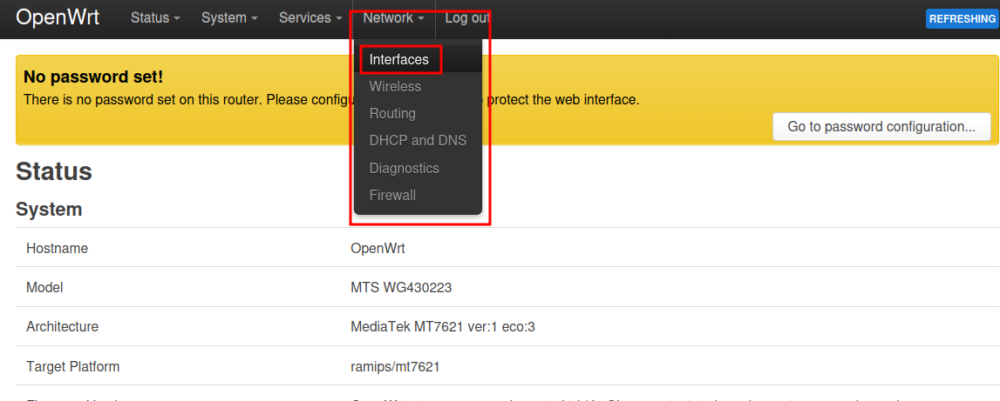
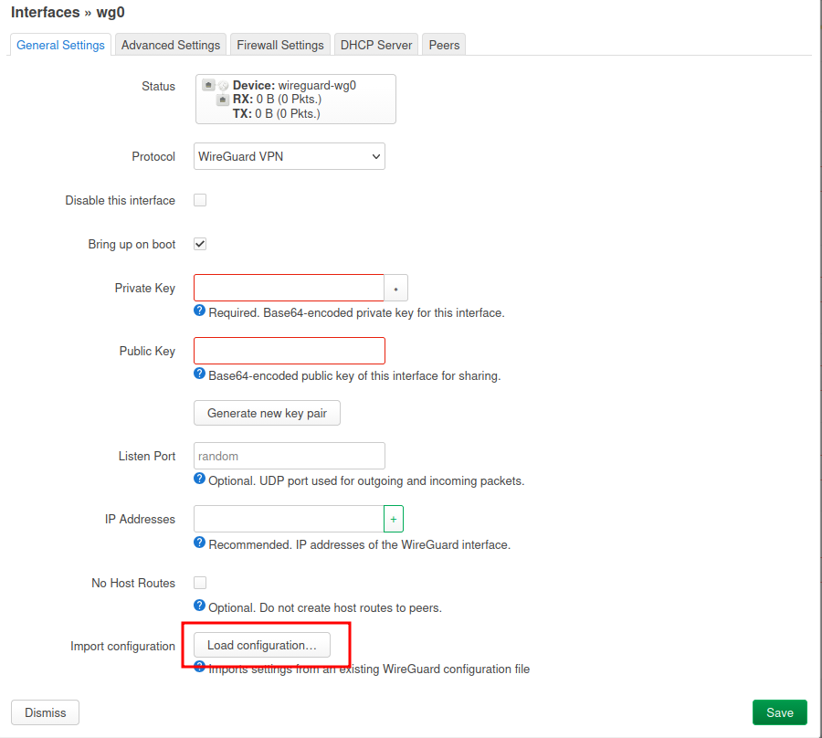
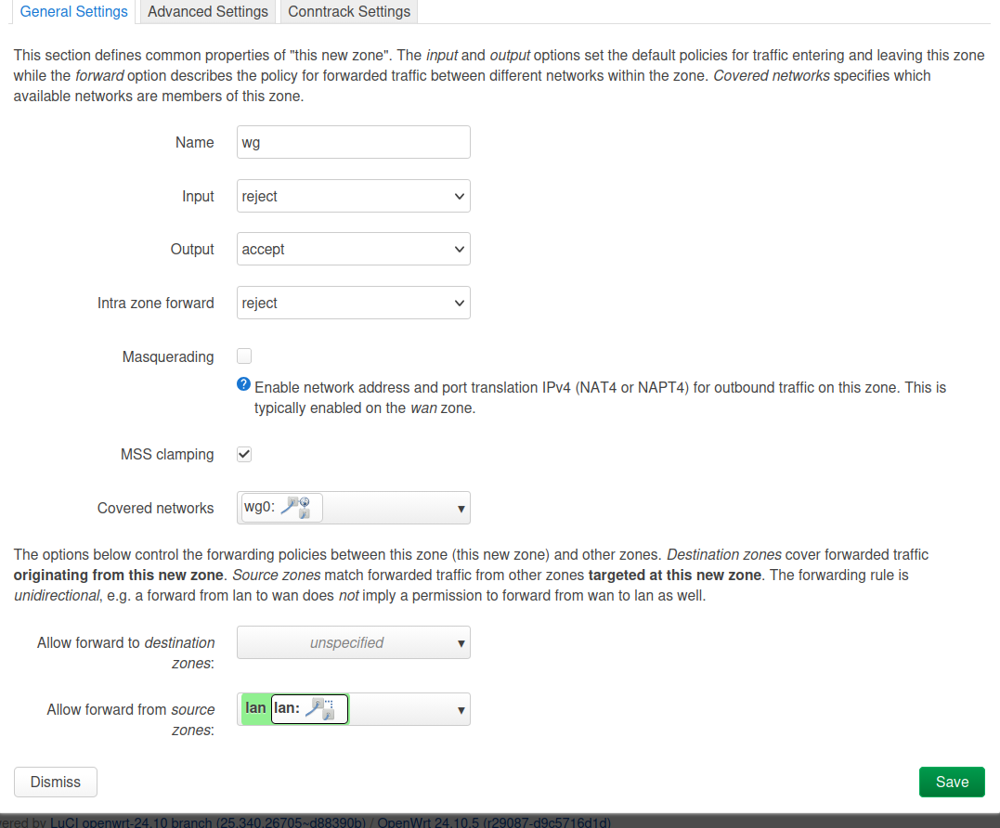
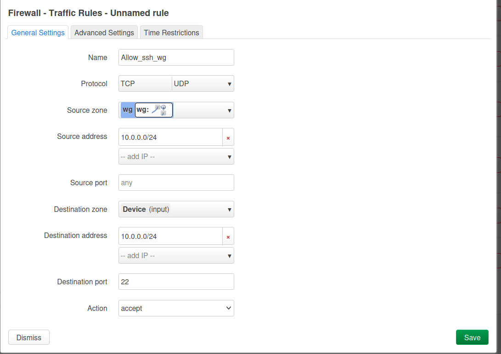
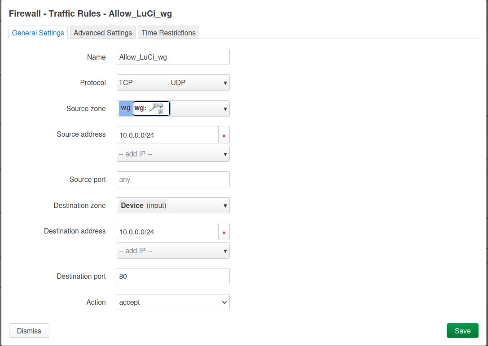

Удалённый доступ решает задачу, когда нужно иногда подключаться с локального ПК к одному или группе роутеров для правки конфигов, обновления пакетов или диагностики. В роли промежуточного узла можно использовать VPS с WireGuard-сервером, через который будет доступен роутер(ы). В примере используется OpenWrt 24.10.5, **Local_router** — роутер у вас дома; **Remote_router** — роутер в другом месте, к которому с локального ПК можно подключаться по SSH и через веб-интерфейс.
> [!NOTE]
> Данный гайд подойдет только для организации удаленного доступа,
> если нужен туннель для обхода блокировок настройки будут другие см. раздел Туннели

### Шаг1.Настройка сервера.(Ubuntu 22.04)
Логинимся на VPS по ssh обновляемся и устанавливаем необходимые пакеты:

```bash
sudo apt update && sudo apt full-upgrade -y
sudo apt install wireguard -y
```
после установки сгенерируем ключи wireguard сервера:

```bash
wg genkey | tee /etc/wireguard/privatekey | wg pubkey | tee /etc/wireguard/publickey
```
Изменим права на приватный ключ:

```bash
chmod 600 /etc/wireguard/privatekey
```
 Создадим конфиг с помощью текстового редактора я буду использовать vim:
```bash
vim /etc/wireguard/wg0.conf
```
Копируем в него следующее содержимое:
```    
       [Interface]
       PrivateKey = <privatekey>
       Address = 10.0.0.1/24
       ListenPort = 51820
       PostUp = iptables -A FORWARD -i %i -j ACCEPT; 
       PostDown = iptables -D FORWARD -i %i -j ACCEPT; 
```
>Порт 51820 является портом по умолчанию для wireguard, можно изменить на другой по необходимости  
> **PostUp**,**PostDown** - скрипты, которые выполняются после поднятия и после остановки интерфейса

выводим  содержимое файла:
```bash
 cat /etc/wireguard/privatekey 
```
и вставляем его вместо \<privatekey>  

Настраиваем IP форвардинг:

```bash
echo "net.ipv4.ip_forward=1" >> /etc/sysctl.conf
sysctl -p
```
Добавим демон wireguard в автозагрузку запустим его и проверим статус:

```bash
systemctl enable wg-quick@wg0.service
systemctl start wg-quick@wg0.service
systemctl status wg-quick@wg0.service
```
Далее создаем на VPS ключи клиента (для Local_router):

```bash
wg genkey | tee /etc/wireguard/local_router_privatekey | wg pubkey | tee /etc/wireguard/local_router_publickey
```
Добавляем в конфиг сервера клиента для этого откроем файл wg0.conf и добавим туда строки:
>рекомендую добавлять комментарий перед Peer что бы потом не запутаться какой ip адрес какому клиенту соответствует
```bash
#Local_router
[Peer]
PublicKey = <local_router_publickey>
AllowedIPs = 10.0.0.2/32
```
Вместо <local_router_publickey>  — заменяем на содержимое файла /etc/wireguard/local_router_publickey

итоговый файл wg0.conf:
```
[Interface]
PrivateKey = <privatekey>
Address = 10.0.0.1/24
ListenPort = 51830
PostUp = iptables -A FORWARD -i %i -j ACCEPT; 
PostDown = iptables -D FORWARD -i %i -j ACCEPT; 


#Local_router
[Peer]
PublicKey = <local_router_publickey>
AllowedIPs = 10.0.0.2/32
```

Что бы изменения применились перезагружаем systemd сервис с wireguard:

```bash
systemctl restart wg-quick@wg0
systemctl status wg-quick@wg0
```
На локальной машине создадим текстовый файл **Local_router.conf** с конфигурацией клиента он будет использоваться для настройки wireguard интерфейса на роутере,
создаем файл и  копируем туда:

```
 [Interface]
 PrivateKey = <CLIENT-PRIVATE-KEY>
 Address = 10.0.0.2/32
 DNS = 8.8.8.8


 [Peer]
 PublicKey = <SERVER-PUBKEY>
 Endpoint = <SERVER-IP>:51830
 AllowedIPs = 10.0.0.0/24
 PersistentKeepalive = 25
```
>Здесь **\<CLIENT-PRIVATE-KEY>** заменяем на приватный ключ клиента, то есть содержимое файла /etc/wireguard/local_router_privatekey на сервере.  **\<SERVER-PUBKEY>** заменяем на публичный ключ сервера, то есть на содержимое файла /etc/wireguard/publickey на сервере. **\<SERVER-IP>** заменяем на IP сервера.


### Шаг2. Настройка роутера **Local_router** 


**Wireguard** пакеты можно установить как через консоль так  и через LuCi (веб-интерфейс).

Установим пакеты через терминал для этого логинимся на роутер по ssh и выполняем команду:
```bash
opkg update && opkg install wireguard-tools luci-proto-wireguard
```

Для установки через LuCi (веб-интерфейс) надо зайти в System - Software и в поле Download and install package ввести имена пакетов нажать OK и подтвердить установку.  


 После установки пакетов добавляем необходимый интерфейс. Для этого заходим в раздел Network - Interfaces:  




 Внизу справа нажимаем `Add new interface` в качестве Protocol выбираем Wireguard VPN, Name - Имя интерфейса, в качестве примера используем wg0
 После этого перед вами откроется страница конфигурации интерфейса.
Теперь необходимо импортировать файл который мы ранее создали на локальной машине **Local_router.conf**.
В открывшемся, после того как мы указали имя и протокол, окне опускаемся вниз и находим кнопку Load Configuration:  




Перетаскиваем файл или копируем данные из вашего пользовательского файла конфигурации в открывшееся окно. После чего нажимаем **Import Settings.**
Переходим во вкладку **Peers** и нажимаем **Edit.** Находим опцию **Route Allowed IPs** ставим галочку ,внизу кликаем Save. Далее переходим во вкладку Advanced Setting находим опцию **Use default gateway** проверям что галочка включена. 
> - опция **Allowed IPs**-подсети, в которые может ходить трафик через туннель. Установлено значение 10.0.0.0/24, что бы весь трафик не шел в туннель
> - опция **Route Allowed IPs** создаёт маршрут через WG интерфейс для перечисленных сетей из параметра Allowed IPs. *Включена*    
> - опция  **Use default gateway** использует шлюз по умолчанию.  *Включена*  
> - такой конфиг подходит для получения удаленного доступа через созданный интерфейс
> - для маршрутизации другого трафика создайте еще один интерфейс с нужными вам настройками

### Добавление zone и forwarding 
Чтобы трафик маршрутизировался корректно и пакеты для внутренней wireguard сети 10.0.0.0/24 уходили туннель настроим для  созданного интерфейса zone firewall и forwarding из lan подсети.
### Через LuCi
Зайти в **Network - Firewall**, промотать до **Zones.** Нажать кнопку **Add**
Заполнить вкладку таким образом:  


Save - Save & Apply

### Через консоль
Открыть файл /etc/config/firewall и добавить туда:  
```
config zone
        option name 'wg'
        option input 'REJECT'
        option output 'ACCEPT'
        option forward 'REJECT'
        option masq '1'
        option mtu_fix '1'
        list network 'wg'

config forwarding
        option src 'lan'
        option dest 'wg'

```
что бы применить правило перезапустить firewall:
```bash
/etc/init.d/firewall restart
```
 Снова вернемся в секцию Interfaces. Необходимо на против созданного нами интерфейса wg0 снова кликнуть Edit. Далее открыть вкладку Firewall Settings выбрать wg в поле Сreate/Assign firewall-zone снова Save - Save & Apply.


зайдем в терминал на роутере и проверим что правила маршрутизации верные:

```bash
ip route get 10.0.0.1
#вывод
10.0.0.1 dev wg0 src 10.0.0.2 uid 0
```
### Шаг3. Настройка **Remote_router**
В целом настройка выполняется аналогично настройке **Local_router**  кроме пары моментов о которых ниже.  
Что бы не повторяться  кратко пробежимся по шагам
На VPS :
- генерируем ключи для **Remote_router**
- добавляем пира в wg0.conf с ip 10.0.0.3 

На локальной машине: 
- создаем файл **Remote_router.conf**  

На роутере:  
- устанавливаем необходимые пакеты 
- создаем интрефейс wg0
- импортируем конфиг **Remote_router.conf**
- добавляем zone firewall  для wg0

Что бы получить удаленный доступ по ssh и в веб интерфейс на **Remote_router** необходимо добавить два правила в firewall 
это позволит достучаться до портов 22 и 80 на которых работают эти службы. Для  этого заходим в Network - Firewall, открываем вкладку Traffic Rules скролим вниз кнопка Add  

правило для ssh  



правило для LuCi(веб интерфейс)  



либо отредактировать /etc/config/firewall добавив:
```
config rule
        option src 'wg'
        option name 'Allow_ssh_awg'
        option target 'ACCEPT'
        list src_ip '10.0.0.0/24'
        option dest_port '22'

config rule
        option src 'wg'
        option name 'Allow_LuCi'
        list src_ip '10.0.0.0/24'
        option dest_port '80'
        option target 'ACCEPT'
        list dest_ip '10.0.0.0/24'

```

Теперь оба роутера настроены можно устанавливать **Remote_router** где то в другой локации. Что бы попасть с локального ПК на этот роутер в браузере можно набрать его wireguard ip например 10.0.0.3 и мы попадем в веб интерфейс этого роутера. Что бы зайти по ssh в консоли можно выполнить команду:

```bash
ssh root@10.0.0.3
```
 Если провайдер блокирует wireguard этот гид подойдет и для AmneziaWG. Отличаться будут только установка пакетов для VPS и для роутера. 


  


