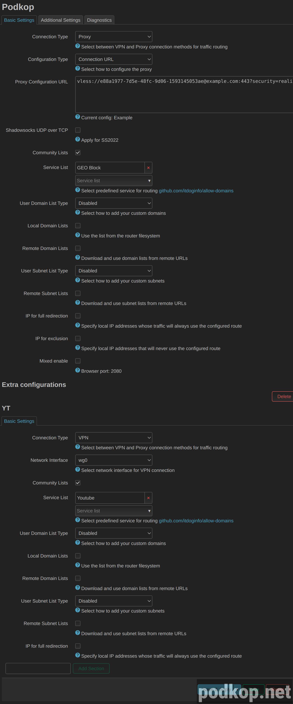

В podkop можно направлять разный трафик в разные outbound (VLESS, WG, AWG, etc). Например список Geoblock вы можете послать в ваш VLESS-сервер, расположенный в Европе, Youtube к WG-серверу в РФ, а инструменты Google AI к Shadowsocks в США.

В OpenWrt LuCi есть понятие секций. Секция - это расширяемая часть конфигов openwrt. Пример упрощенного основного конфига main и экстра-секции **wg**:
```
config main 'main'
	option domain_list_enabled '1'
	option proxy_string 'string'
	list domain_list 'geoblock'

config extra 'wg'
	option mode 'vpn'
	option domain_list_enabled '1'
	list domain_list 'youtube'
	option interface 'wg0'
```

Экстра-секций может быть любое количество. Вы можете перенаправлять нужный вам трафик, даже если этого нет в предустановленных списках.

Как это настраивается в LuCi


