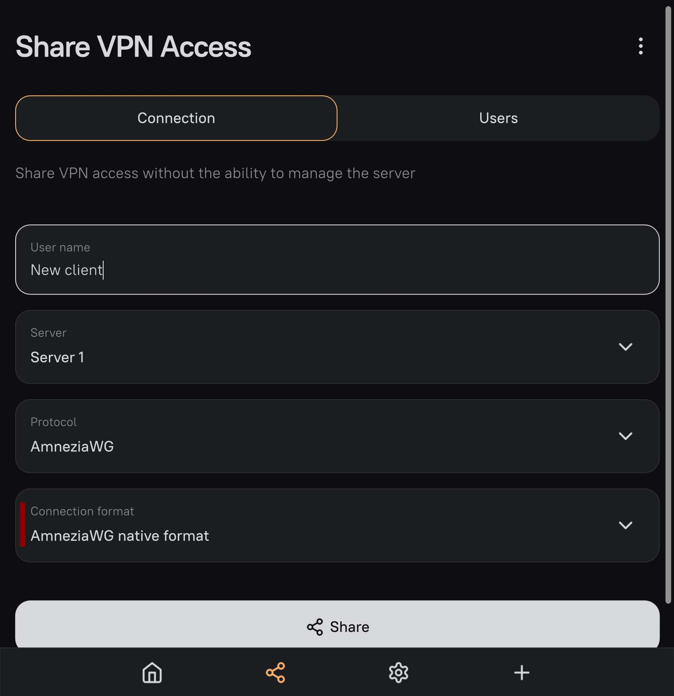
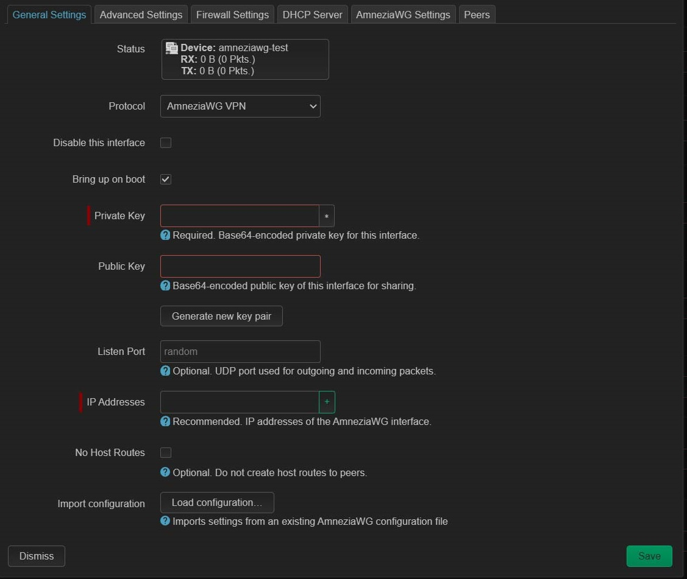
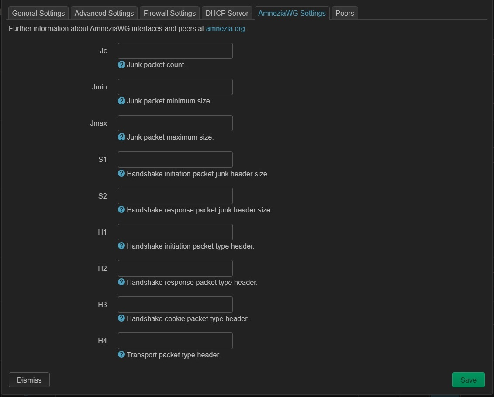
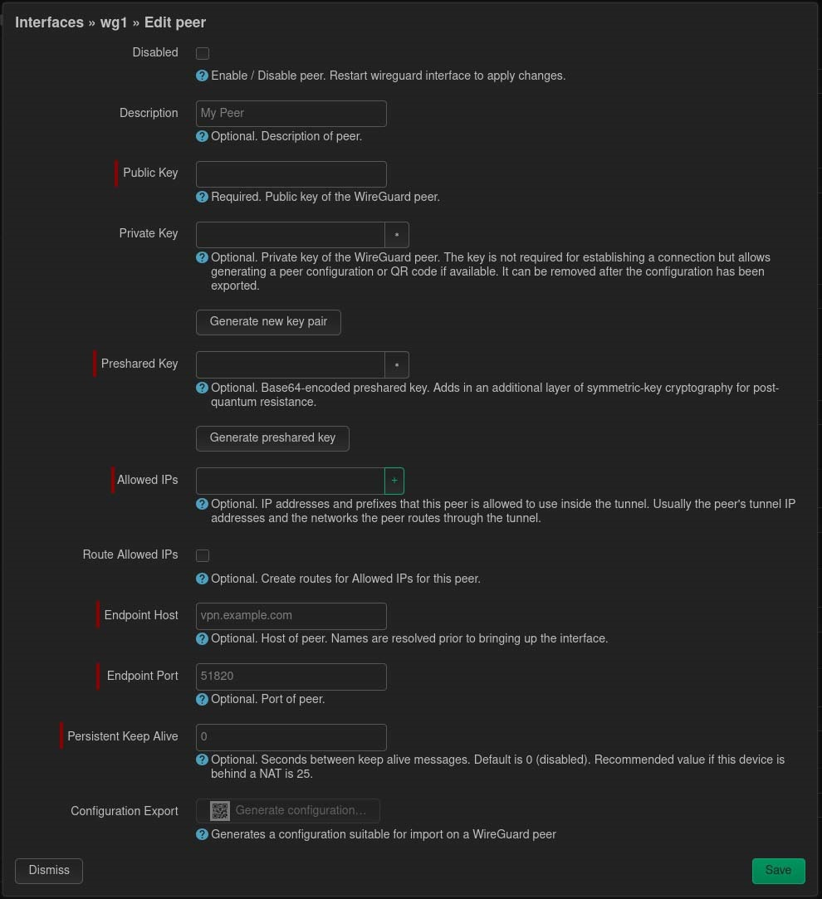
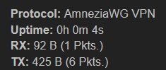

Туннель можно настроить через консоль и через LuCi(веб-интерфейс).

Предполагается что у вас есть работающий клиентский конфиг. 

## Установка пакетов

Пакетов для работы с AmneziaWG нет в репозитории OpenWRT, поэтому нам потребуется использовать скрипт для установки или вручную скачать файлы и установить их на роутер.

### С помощью автоматического скрипта: 
```
sh <(wget -O - https://raw.githubusercontent.com/Slava-Shchipunov/awg-openwrt/refs/heads/master/amneziawg-install.sh)
```

Нас интересует только установка пакетов поэтому запускаем скрипт, а на вопрос **Do you want to configure the amneziawg interface?** отвечаем **N**

> [!NOTE]
> Скрипт выполняет установку только для стабильной версии OpenWRT.

### Ручная установка

Нужно скачать 3 файла под вашу архитектура процессора [здесь](https://github.com/lolo6oT/awg-openwrt/releases) или [здесь](https://github.com/Slava-Shchipunov/awg-openwrt/releases):
```
kmod-amneziawg.ipk
amneziawg-tools.ipk
luci-proto-amneziawg.ipk (либо luci-app-amneziawg.ipk)
```

Чтобы узнать архитектуру выполните в терминале:
```
opkg print-architecture | awk 'BEGIN {max=0} {if ($3 > max) {max = $3; arch = $2}} END {print arch}'
```

Чтобы узнать архитектуру через LuCi мы можем перейти в  **System - Software** и нажать **Update lists**. В появившемся окне нас будет интересовать строка вида:
```
https://downloads.openwrt.org/releases/24.10.0/packages/aarch64_cortex-a53/base/Packages.gz
```

`aarch64_cortex-a53` и будет указывать на архитектуру нашего процессора.

Для установки через LuCi надо зайти в **System - Software**, нажать **Upload package** и выполнить установку скачаных пакетов по одному.

Либо переместить загруженные файлы на роутер и выполнить:
```
opkg install kmod-amneziawg.ipk amneziawg-tools.ipk luci-proto-amneziawg.ipk (либо luci-app-amneziawg.ipk)
```

## О правилах фаервола

Для работы с Podkop нам не требуется создавать зону фаервола и настраивать перенаправление с lan. 
Если вам они нужны вы можете или согласиться на настройку интерфейса с помощью скрипта установки или использовать эту [инструкцию](https://github.com/openwrt-xiaomi/awg-openwrt/wiki/AmneziaWG-installing)
> [!NOTE]
> Скрипт включит перенаправление всего траффика через тунель AmneziaWG (установит в настройках Peer галочку Route Allowed IPs. Если вам не нужно направлять весь траффик через тунель не забудьте снять галочку.

## Пример пользовательского файла конфигурации

Клиентский файл конфигурации обычно имеет следующий вид:
```
[Interface]
PrivateKey = HNecyq7AWW42URwuINa3bavAPYsasGnbMXzNzLgBT3s=
S1 = 0
S2 = 0
Jc = 3
Jmin = 10
Jmax = 50
H1 = 904321824
H2 = 245411986
H3 = 663334667
H4 = 1944657114
Address = 172.16.0.2

[Peer]
PublicKey = bmXOC+F1FxEMF9dyiK2H5/1SUtzH0JuVo51h2wPfgyo=
AllowedIPs = 0.0.0.0/0
Endpoint = HOST:IP


```

### У меня ссылка вида vpn://, что делать?

Если вы настраивали сервер через приложение AmneziaVPN, то вы можете перейти в раздел **Share VPN Access** и выбрать в пункте **Connection format** - **AmneziaWG native format**, после чего нажать кнопку **Share** и получить конфиг в виде необходимых параметров.

Если вы не являетесь владельцем сервера, то вам остается или воспользоваться [решением](https://github.com/amnezia-vpn/config-decoder) от AmneziaVPN и из полученного конфига и его строки `last config` получить все значения для полей из примера или воспользоваться сторонним [решением](https://github.com/rakodin/awgdecoder), которое потребует установки Java.

## Настройка через файл конфигурации

В OpenWRT мы так же имеем две части: Interface и Peer. Открываем файл `/etc/config/network` и добавляем следующие строки:
```
# Interface
config interface 'awg0'
	option proto 'amneziawg'
	option listen_port '51820'
	option private_key '$PRIVATE_KEY'
	list addresses '$AWG_IP'
	option awg_s1 '$S1'
	option awg_s2 '$S2'
	option awg_jc '$Jc'
	option awg_jmin '$Jmin'
	option awg_jmax '$Jmax'
	option awg_h1 '$H1'
	option awg_h2 '$H2'
	option awg_h3 '$H3'
	option awg_h4 '$H4'


# Peer
config amneziawg_awg0
	option name 'awg0_client'
	option route_allowed_ips '0'
	option persistent_keepalive '25'
	list allowed_ips '0.0.0.0/0'
	option endpoint_host '$HOST'
	option endpoint_port '51820'
	option public_key '$PUBLIC_KEY'
	option preshared_key '$PRESHARED_KEY'
```

В переменные, начинающиеся с $ нужно подставить значения из вашего конфига.

### Часть Interface

**proto** — протокол, указывающий OpenWRT, что это конфигурация AmneziaWG

**listen_port** — порт на котором WireGuard принимает соединения. Это можно не трогать или убрать, тогда порт будет случайным.

**private_key** — это приватный ключ клиента

**list addresses** — адрес в AWG сети. В примере конфига 172.16.0.2.

AmneziaWG использует следующие параметры для обфускации трафика:

**awg_jc, awg_jmin, awg_jmax** - эти параметры определяют количество и размер "мусорных" пакетов, отправляемых перед началом VPN-сессии.
**awg_s1, awg_s2** - эти параметры добавляют "мусор" в пакеты рукопожатия, изменяя их размер.
**awg_h1, awg_h2, awg_h3, awg_h4** - эти параметры используются для дополнительной обфускации пакетов. Их точное назначение не раскрывается, но они обязательны для работы AmneziaWG.

### Часть peer (здесь называется amneziawg_awg0)

**route_allowed_ips** — флаг, который создаёт маршрут через AWG интерфейс для перечисленных сетей из параметра **allowed_ips**. Если 1 и **allowed_ips=0.0.0.0/0**, то весь трафик будет идти через AWG. Мы указываем 0 - выключено.

**persistent_keepalive** — интервал времени, через который отправляются пакеты для поддержки соединения. Оставляем значение 25.

**allowed_ips** — подсети, в которые может ходить трафик через туннель. В большинстве случаев никаких ограничений не требуется, поэтому 0.0.0.0/0

**endpoint_host** — ip/url вашего сервера. Часть **HOST** клиентского конфига в поле **Endpoint**

**endpoint_port** — порт AmneziaWG на сервере. Указан в **Endpoint** после **HOST**:

**public_key** — публичный ключ сервера

**preshared_key** - ключ PRESHARED_KEY нужно указывать только, если сервер поддерживает это и он есть в конфиге

#### Если нужна поддержка IPv6:

В `interface` добавить
```
	list addresses '$AWG_IPv6'
```

В `amneziawg_awg0`
```
	option allowed_ips '::/0'
```

Эта часть добавляется в конец файла конфигурации. После этого необходимо перезагрузить сеть `service network restart`.

После перезагрузки должен появиться интерфейс awg0:
```
root@OpenWrt:~# ip a | grep awg0
770: awg0: <POINTOPOINT,NOARP,UP,LOWER_UP> mtu 1280 qdisc noqueue state UNKNOWN group default qlen 1000
    inet 172.16.0.2/32 brd 255.255.255.255 scope global awg0
```


## Настройка через UCI

В переменные начинающиеся с $ нужно подставить ваши значения

```
uci set network.awg0="interface"
uci set network.awg0.proto="amneziawg"
uci set network.awg0.private_key="$PRIVATE_KEY"
uci set network.awg0.listen_port="51820"
uci add_list network.awg0.addresses="$AWG_IP"
 
uci set network.awg0.awg_jc=$JC
uci set network.awg0.awg_jmin=$JMIN
uci set network.awg0.awg_jmax=$JMAX
uci set network.awg0.awg_s1=$S1
uci set network.awg0.awg_s2=$S2
uci set network.awg0.awg_h1=$H1
uci set network.awg0.awg_h2=$H2
uci set network.awg0.awg_h3=$H3
uci set network.awg0.awg_h4=$H4

uci set network.peer="amneziawg_awg0"
uci set network.peer.public_key="$PUBLIC_KEY"
uci set network.peer.endpoint_host="$HOST"
uci set network.peer.endpoint_port="$IP"
uci set network.peer.route_allowed_ips="0"
uci set network.peer.persistent_keepalive="25"
uci set network.peer.allowed_ips="0.0.0.0/0"
```

Если в конфиге есть PRESHARED_KEY
```
uci set network.peer.preshared_key="$PRESHARED_KEY"
```

Если нужна поддержка IPv6
```
uci add_list network.awg0.addresses="$AWG_IPv6"
uci add_list network.peer.allowed_ips="::/0"
```

Описание опций можно узнать [здесь](#%d1%87%d0%b0%d1%81%d1%82%d1%8c-interface)

Затем применить изменения и перезагрузить сеть.
```
uci commit network
service network restart
```

## Настройка через LuCi

Добавляем необходимый интерфес. Для этого заходим в раздел **Network - Interfaces** и нажимаем **Add new interface**. В качестве Protocol выбираем **AmneziaWG VPN**, Name - Имя интерфейса, в качестве примера используем **awg0**. После этого перед вами откроется страница конфигурации интерфейса. Здесь есть два пути:

- Импорт через файл конфигурации
- Вручную внести все параметры

### Импорт через файл конфигурации

В открывшемся, после того как мы указали имя и протокол, окне опускаемся вниз и находим кнопку **Load Configuration**. Перетаскиваем файл или копируем данные из вашего пользовательского файла конфигурации в открывшееся окно.
После чего нажимаем **Import Settings**. Скорее всего окно, куда вы перетаскивали файл не закроется, поэтому затем нажимаем **Cancel**. Тем не менее параметры будут вставлены, но у вкладки **AmneziaWG Settings** появится оповещение об ошибках. Переходим на неё и руками заменяем значения на значения из нашего конфига.

Переходим во вкладку **Peers** и нажимаем **Edit**. Находим опцию **Persistent Keep Alive** и вводим значeние 25.

Если ваша конфигурация содержала адреса DNS-серверов, то следует зайти во вкладку **Advanced Settings** и проверить поле **Use custom DNS servers** и удалить адреса серверов.

Нажимаем **Save - Save - Save - Save & Apply** и после этого **Restart** рядом с только что созданным интерфейсом. Напротив строчек **RX** и **TX** должны появиться значения, отличные от 0.

### Ручное внесение параметров

Нужно перенести вручную параметры переменных из клиентского конфига в вэб-интерфейс.

В **General Setting** нужно внести параметры из секции `[Interface]` вашего конфига:



- Private Key
- IP Addresses

Поле `Public Key` не сгенерируется автоматически и будет гореть красным. Чтобы это исправить нам нужно
нажать **Save** и **Dismiss**, затем нажать **Edit** напротив нашего интерфейса и продолжить настройку.


Далее переходим на вкладку **AmneziaWG Settings** и заполняем все имеющиеся поля значениями из вашего конфига.



Далее переходим на вкладку **Peers** и нажимаем **Add peer**, а затем **Edit** рядом с появившейся строкой.



В открывшемся окне нам нужно внести параметры из секции `[Peer]` вашего конфига:

- Public Key
- Preshared Key, если он есть в конфиге
- Allowed IPs
- Endpoint Host
- Endpoint Port
- Persistent Keep Alive

Если вам не нужно перенаправлять весь трафик в WG, то галочка у `Route Allowed IPs` должна быть выключена. Она создаёт маршрут через AWG интерфейс для перечисленных сетей из параметра `Allowed IPs`. Если галочка проставлена и `Allowed IPs: 0.0.0.0/0`, то весь трафик будет идти через WG.


После этого нажимаем **Save, Save, Save & Apply**.

У интерфейса должны появиться не нулевые значения в полях **RX и TX**. 



## Проверка работы интерфейса
### Через консоль

Посмотреть статистику AWG можно через команду `amneziawg show`. Нас интересует `latest handshake`, он должен быть меньше двух минут и `transfer`: в received и sent должны быть не равны 0.
```
peer: bmXOC+F1FxEMM9dyiK2H5/1SUtzL0JuVo51h2wPfgyo=
  endpoint: $host:$port
  allowed ips: 0.0.0.0/0
  latest handshake: 1 minute, 49 seconds ago
  transfer: 1.08 KiB received, 340.04 KiB sent
  persistent keepalive: every 25 seconds
```

Проверить что туннель работает, можно простым пингом с указанием интерфейса
```
ping -I awg0 itdog.info
```

### Через LuCi

Перейти в **Status - AmneziaWG** и в поле `Latest Handshake` он должен быть меньше двух минут. `Data Received` и `Data Transmitted` не должны быть равны 0.

## Использованием AmneziaWG с сервером Wireguard

Если у вас наблюдается проблемы с работой Wireguard у нас есть возможность обфусцировать Wireguard конфиг, используя AmneziaWG не меняя настройки сервера. Для этого нам нужно в наш конфиг Wireguard добавить следующие параметры: Jc,Jmin,Jmax, S1, S2, H1, H2, H3, H4 и заменить протокол с **Wireguard** на **AmneziaWG VPN**

В итоговом варианте конфиг будет выглядеть следующим образом:
```
[Interface]
PrivateKey = SMJ1k2xXcqQOzuGmbLRZiJdilhpPyW7002FlDmzJoms=
Address = 10.0.0.3/32

Jc = $Jc
Jmin = $Jmin
Jmax = $Jmax
S1 = 0 
S2 = 0
H1 = 1
H2 = 2
H3 = 3
H4 = 4

[Peer]
PublicKey = R2NAFxYRL7T5POMOmNMemaU1MEKUZEvVYAeeHvLryyU=
PresharedKey = hfrTs4UAoK/SaOBbjajO87DBfEMonVrAAxYiJnnwgKg=
Endpoint = HOST:IP
AllowedIPs = 0.0.0.0/0
```

Важно отметить, что параметры **S1, S2** и **H1, H2, H3, H4** должны оставаться равными указанным значениям (иначе ничего не заработает), значение параметра **Jc** должно быть от 1 до 128, значение **Jmin** не должно превышать **Jmax**, а **Jmax** должно быть не больше 1280. Эти три параметра вы можете изменять, соблюдая указанные условия.

