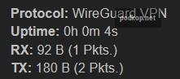

Туннель можно настроить через консоль и через LuCi (веб-интерфейс).

Предполагается что у вас есть работающий клиентский конфиг. 

## Установка пакетов

Через терминал: 
```
opkg update && opkg install wireguard-tools luci-proto-wireguard
```

Для установки через LuCi надо зайти в **System - Software** и в поле **Download and install package** ввести имена пакетов нажать **OK** и подтвердить установку.

## О правилах фаервола

Для работы с Podkop нам не требуется создавать зону фаервола и настраивать перенаправление с lan. 
Если вам нужно использовать на роутере Wireguard не только для Podkop то обратитесь к [статье](https://itdog.info/nastrojka-klienta-wireguard-na-openwrt/).

## Использование с WARP

Если туннель будет использоваться с WARP и списком подсетей **Cloudflare**, то дополнительно потребуется указать **Firewall Mark** в дополнительных настройках, как указано [здесь](/docs/faq/#kak-ispolzovat-warp-i-polzovatelskij-spisok-podsetej-cloudflare).

## Пример пользовательского файла конфигурации

Клиентский файл конфигурации обычно имеет следующий вид:
```
[Interface]
PrivateKey = SMJ1k2xXcqQOzuGmbLRZiJdilhpPyW7002FlDmzJoms=
Address = 10.0.0.3/32

[Peer]
PublicKey = R2NAFxYRL7T5POMOmNMemaU1MEKUZEvVYAeeHvLryyU=
PresharedKey = hfrTs4UAoK/SaOBbjajO87DBfEMonVrAAxYiJnnwgKg=
Endpoint = HOST:IP
AllowedIPs = 0.0.0.0/0

```

## Настройка через LuCi

Добавляем необходимый интерфейс. Для этого заходим в раздел **Network - Interfaces** и нажимаем **Add new interface**. В качестве `Protocol` выбираем **Wireguard VPN**, `Name` - Имя интерфейса, в качестве примера используем **wg0**. После этого перед вами откроется страница конфигурации интерфейса. Здесь есть два пути:

- Импорт через файл конфигурации
- Вручную внести все параметры

### Импорт через файл конфигурации

В открывшемся, после того как мы указали имя и протокол, окне опускаемся вниз и находим кнопку **Load Configuration**. Перетаскиваем файл или копируем данные из вашего пользовательского файла конфигурации в открывшееся окно.
После чего нажимаем **Import Settings**.

Переходим во вкладку **Peers** и нажимаем **Edit**. Находим опцию **Persistent Keep Alive** и вводим значeние 25. Без этой опции интерфейс не соединяется с сервером.

Если ваша конфигурация содержала адреса DNS-серверов, то следует зайти во вкладку **Advanced Settings** и проверить поле **Use custom DNS servers** и удалить адреса серверов.

Нажимаем **Save - Save - Save & Apply** и после этого **Restart** рядом с только что созданным интерфейсом. Напротив строчек RX и TX должны появиться следующие значения: RX: 92, TX: 180.

### Ручное внесение параметров

Нужно перенести вручную параметры переменных из клиентского конфига в вэб-интерфейс.

В **General Setting** нужно внести параметры из секции `[Interface]` вашего конфига:


- Private Key
- IP Addresses

Поле `Public Key` не сгенерируется автоматически и будет гореть красным. Чтобы это исправить нам нужно
нажать **Save** и **Dismiss**, затем нажать **Edit** напротив нашего интерфейса и продолжить настройку.

Или сгенерировать ключ в терминале, используя ваш приватный ключ из раздела `Interface`:

```
echo 'SMJ1k2xXcqQOzuGmbLRZiJdilhpPyW7002FlDmzJoms=' | wg pubkey
```

Далее переходим на вкладку **Peers** и нажимаем **Add peer**, а затем **Edit** рядом с появившейся строкой.


В открывшемся окне нам нужно внести параметры из секции `[Peer]` вашего конфига:

- Public Key
- Preshared Key, если он есть в конфиге
- Allowed IPs
- Endpoint Host
- Endpoint Port
- Persistent Keep Alive

Галочка у опции `Route Allowed IPs` должна быть снята. Она создаёт маршрут через WG интерфейс для перечисленных сетей из параметра `Allowed IPs`. Если галочка проставлена и `Allowed IPs: 0.0.0.0/0`, то весь трафик будет идти через WG.


После этого нажимаем **Save, Save, Save & Apply**.

У интерфейса должны появиться числа в полях RX и TX. 



## Настройка через консоль

### Настройка через файл конфигурации

В OpenWRT мы так же, как и в пользовательском конфиге, имеем две части: Interface и Peer. Открываем файл `/etc/config/network` и добавляем следующие строки:
```
# Отвечает за Interface
config interface 'wg0'
	option proto 'wireguard'
	option listen_port '51820'
	option private_key '$PRIVATE_KEY'
	list addresses '$WG_IP'

# Отвечает за Peer
config wireguard_wg0
	option name 'wg0_client'
	option route_allowed_ips '0'
	option persistent_keepalive '25'
	list allowed_ips '0.0.0.0/0'
	option endpoint_host '$HOST'
	option endpoint_port '51820'
	option public_key '$PUBLIC_KEY'
	option preshared_key '$PRESHARED_KEY'
```

В переменные, начинающиеся с $ нужно подставить значения из вашего конфига.

### Часть Interface

**proto** — протокол, указывающий OpenWRT, что это конфигурация WireGuard

**listen_port** — порт на котором WireGuard принимает соединения. Это можно не трогать или убрать, тогда порт будет случайным.

**private_key** — это приватный ключ клиента

**list addresses** — адрес в WG сети. В примере конфига 10.0.0.3/32.

### Часть peer (здесь называется wireguard_wg0)

**route_allowed_ips** — флаг, который создаёт маршрут через WG интерфейс для перечисленных сетей из параметра **allowed_ips**. Если 1 и **allowed_ips=0.0.0.0/0**, то весь трафик будет идти через WG. Мы указываем 0 - выключено.

**persistent_keepalive** — интервал времени, через который отправляются пакеты для поддержки соединения. Оставляем значение 25.

**allowed_ips** — подсети, в которые может ходить трафик через туннель. В большинстве случаев никаких ограничений не требуется, поэтому 0.0.0.0/0

**endpoint_host** — ip/url вашего сервера. Часть **HOST** клиентского конфига в поле **Endpoint**

**endpoint_port** — порт WireGuard на сервере. Указан в **Endpoint** после HOST:

**public_key** — публичный ключ сервера

**preshared_key** - ключ PRESHARED_KEY нужно указывать только, если сервер поддерживает это и он есть в конфиге

После перезагрузки должен появиться интерфейс wg0:
```
root@OpenWrt:~# ip a | grep wg0
21: wg0: <POINTOPOINT,NOARP,UP,LOWER_UP> mtu 1420 qdisc noqueue state UNKNOWN group default qlen 1000
    inet 10.8.0.4/32 brd 255.255.255.255 scope global wg0
```


### Настройка через UCI

В переменные начинающиеся с $ нужно подставить ваши значения

```
uci set network.wg0="interface"
uci set network.wg0.proto="wireguard"
uci set network.wg0.private_key="$PRIVATE_KEY"
uci set network.wg0.listen_port="51820"
uci add_list network.wg0.addresses="$WG_IP"
 
uci set network.peer="wireguard_wg0"
uci set network.peer.public_key="$PUBLIC_KEY"
uci set network.peer.endpoint_host="$HOST"
uci set network.peer.endpoint_port="$IP"
uci set network.peer.route_allowed_ips="0"
uci set network.peer.persistent_keepalive="25"
uci set network.peer.allowed_ips="0.0.0.0/0"
```

Если в конфиге есть `PRESHARED_KEY`
```
uci set network.peer.preshared_key="$PRESHARED_KEY"
```


Описание опций можно узнать [здесь](#chast-interface).

Затем применить изменения и перезагрузить сеть.
```
uci commit network
service network restart
```


## Проверка работы интерфейса

### Через LuCi

Перейти в **Status - Wireguard** и в поле `Latest Handshake` он должен быть меньше двух минут. `Data Received` и `Data Transmitted` не должны быть равны 0.

### Через консоль

Посмотреть статистику WG можно через команду `wg show`. Нас интересует `latest handshake`, он должен быть меньше двух минут и `transfer`: в received и sent должны быть не равны 0.
```
peer: R6NAFxYRL6T5KOMOmNMemaU0MEKUZEvVYAxeLvLryyU=
  preshared key: (hidden)
  endpoint: $HOST:$PORT
  allowed ips: 0.0.0.0/0
  latest handshake: 11 seconds ago
  transfer: 92 B received, 180 B sent
  persistent keepalive: every 25 seconds
```

Проверить что туннель работает, можно простым пингом с указанием интерфейса
```
ping -I wg0 itdog.info
```

