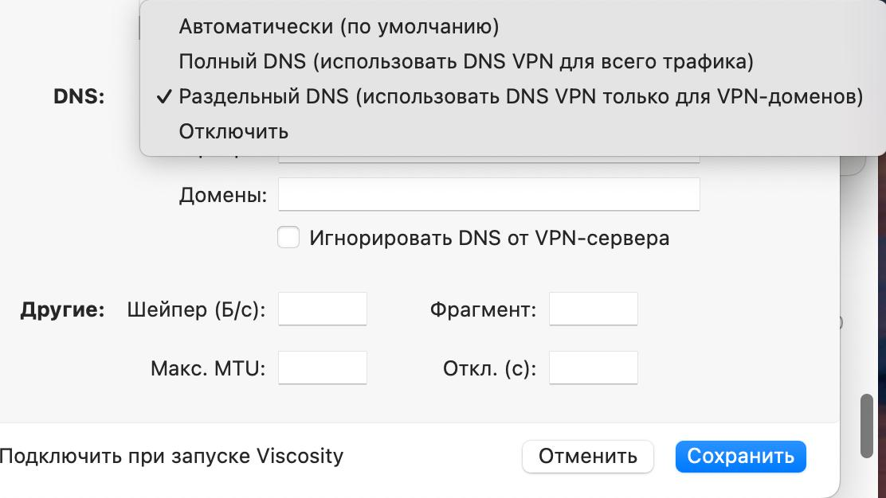

Как &laquo;подружить&raquo; корпоративный VPN и `Podkop`?

Суть проблемы: вы включаете клиент VPN на своём устройстве (ПК, ноутбук), тот назначает себя DNS-сервером и шлюзом в свою подсеть (в лучшем случае) или для всех IP-адресов, кроме локальных.  
В результате схема [Fake IP]() перестаёт работать, так как все программы вашего устройства получают для доменов из списков реальные, а не Fake IP-адреса.

Если на своём устройстве вы не можете отключить использование корпоративного DNS для некорпоративных доменов --- ниже описаны два способа:

## 1. Используем Mixed-режим (sing-box на роутере как прокси-сервер)
Работает, если:
1. Не заблокировано управление настройками прокси в браузере
2. Корпоративный VPN не перехватывает пакеты до роутера: LuCI открывается при включенном VPN

Как настроить:
1. LuCI &#8594; Services &#8594; Podkop &#8594; В основной секции 
[Включить смешанный режим | Mixed enable](/docs/sections/#vklyuchit-smeshannyj-proksi-mixed-enable)
2. Браузер &#8594; Настройки &#8594; Настройка прокси &#8594; Указать IP вашего роутера и порт 2080 (например `192.168.1.1:2080`). 
Не забудьте в исключениях прокси указать вашу локальную подсеть и домены корпоративных ресурсов

## 2. Настраиваем подключение к корпоративному VPN на роутере
Работает, если:
1. Есть OpenWrt-пакет для вашего VPN-клиента (например, OpenVPN)
2. Для подключения не используется второй фактор (SMS, TOTP и т.п.) или пакет OpenWrt умеет этот второй фактор обрабатывать
3. Корпоративный VPN создаёт маршруты только до своей подсети или создание маршрутов можно отключить

Как настроить:
1. Устанавливаем пакеты и настраиваем подключение к корпоративному VPN на роутере.  
[Пример для OpenVPN](/docs/tunnels/ovpn_settings/). 
Не забудьте добавить в конфиг `pull-filter ignore redirect-gateway`, если ваш VPN создаёт маршруты для всего трафика
2. LuCI &#8594; Services &#8594; Podkop &#8594; В **основной** секции настраиваем корпоративный VPN  
Connection Type: VPN  
Network Interface: выбираем созданный интерфейс  
User Domain List Type: выбираем Text List или Dynamic List и указываем корпоративные домены  
3. LuCI &#8594; Services &#8594; Podkop &#8594; Additional Settings: включаем Split DNS (тип UDP, адрес вашего DNS из корпоративной сети).
4. Добавляем **дополнительные** секции для прокси и раздельного туннелирования по спискам.

## Viscosity VPN

Для нормальной работы `Podkop` укажите в настройках клиента Viscosity **Раздельный DNS**:

