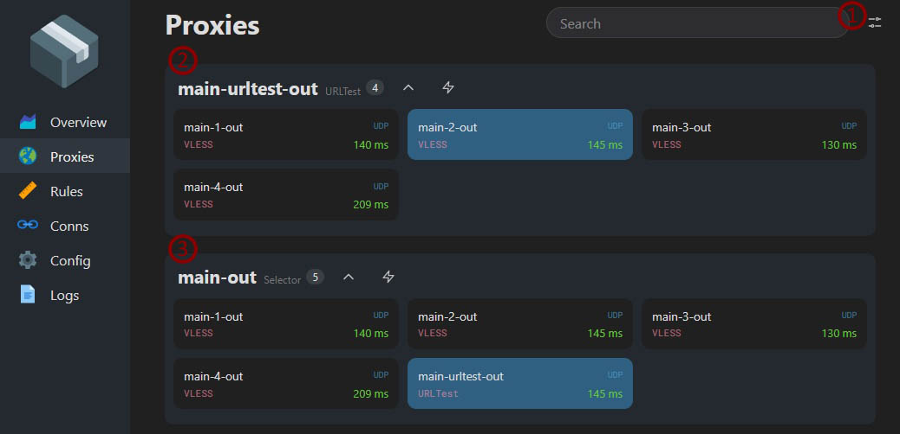
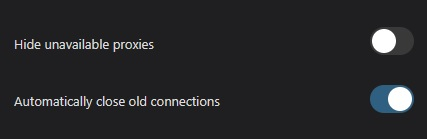

Yacd позволяет отследить соединения, которые направляются в прокси, информацию об использовании sing-box памяти, список используемых прокси и правил.
Не хранит историю, т.е при закрытии окна с Yacd она будет утеряна.

Как включить?

1. Заходим в настройки Podkop -> Дополнительные настройки (вторая вкладка)

2. Ставим галочку напротив пункта Включить Yacd (Yacd enable)

3. Сохраняем настройки Podkop
Save & Apply

4. Переходим по адресу http://openwrt.lan:9090/ui или по IP-адресу http://192.168.1.1:9090/ui в зависимости от того какой назначен роутеру. Здесь и далее используется `192.168.1.1`.

5.  В открывшемся окне в поле API Base URL мы вводим адрес нашего роутера и порт: 192.168.1.1:9090

Поле **Secret** можно оставить пустым, если вы не активировали настройку **Enable YACD WAN Access**. В случае если настройка была активирована вам необходимо указать ключ, указанный в опции [**YACD Secret Key**](/docs/settings/#sekretnyi-klyuch-yacd-yacd-secret-key)

После чего нажимаем кнопку Add и кликаем по появившемуся в списке внизу адресу, который мы только что добавили.

## Узнаем ушел ли сайт в прокси

Выбрав, в открывшейся панели, раздел Conns и зайдя, в другой вкладке браузера,  на интересующую нас страницу, мы сможем увидеть ушли ли они в прокси.

Теперь при заходе по адресу 192.168.1.1:9090 мы будем попадать в панель Yacd. Но у меня это сохраняется до момента очистки данных страницы роутера, затем приходится вводить API Base URL повторно.

Ссылка на страницу с документации Sing-box:
https://sing-box.sagernet.org/configuration/experimental/clash-api/

## Ручное переключение прокси

Заходим в раздел Proxies в yacd.

Для того, чтобы при смене прокси автоматически закрывались действующие соединения, щелкаем по меню настроек **(1)** и переключаем ползунок **Automatically close old connections**.

В разделе **(2)** отображается действующая ссылка, выбранная с помощью `URLTest`.

Для ручного переключения нам нужно выбрать ссылку в разделе **(3)**. 

Чтобы вернуть автоматическое переключение ссылок, нужно выбрать в разделе **(3)** **main-urltest-out**.

>[!Note]
>Если в опции **Cache File Path** вкладки **Settings** используется `RAM`, то после перезагрузки устройства вернется режим автоматического переключения ссылок.
